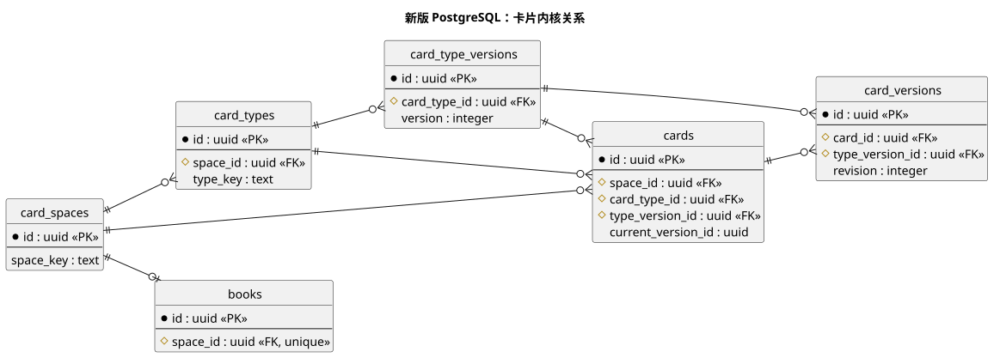
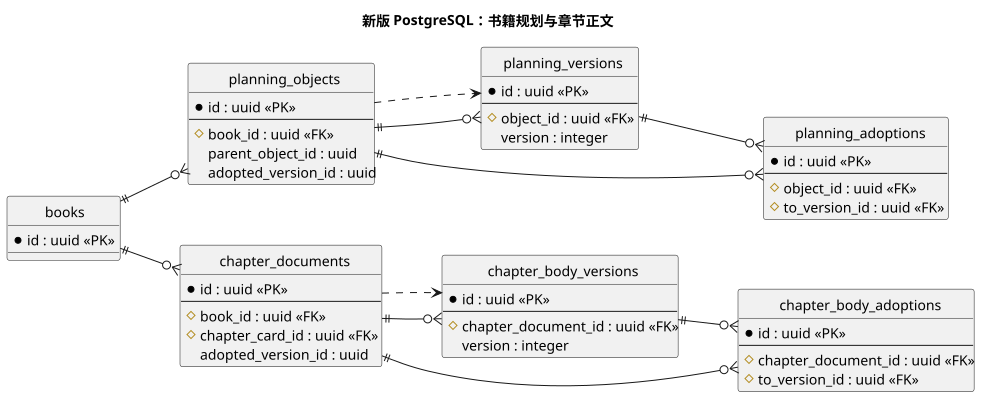

# 新版数据库架构与迁移

## 范围与权威来源

`new-design/` 使用独立 PostgreSQL `new_design` schema 保存书籍、卡片、正式内容和业务运行记录。旧版 SQLite 及其 API、模型执行链仅供页面与功能对标，两套系统不能相互调用或共享业务数据。本文说明数据归属和迁移边界；完整表关系、字段和业务含义见[新版数据字典](../../new-design/docs/data-model.md)，物理定义以[迁移 SQL](../../new-design/migrations/)为准。

## 数据归属

`131_card_kernel_v2_cutover.sql` 是新版数据库的最终物理边界：完成后 `new_design` 固定为 79 张应用表，AGE 图 `new_design_projection` 固定为 4 张扩展投影表，总物理表数 83。页面和 API 继续使用原业务语言，但稳定对象、候选版本、采用／发布／归档动作以及结构关系分别统一进入 `cards`、`card_versions`、`card_version_actions` 与 `card_relations`。正文原文、二进制资产、模型执行、后台任务和传输恢复保留专用账本。

截至 2026-09-22，本机作者库已在完整备份和独立恢复演练后安装到 128 项迁移，`card_kernel_v2` 能力为可运行，物理表数已达到 79+4。为保持现有页面、路由和 API 行为，数据库还保留 344 个 `new_design` 兼容视图和 324 个 `new_design_compat` 行类型；它们不是物理表，但说明业务仓储尚有旧对象名依赖。当前结论应写为“物理模型已收敛，业务仓储处于兼容迁移期”，不能仅凭 83 张物理表宣称运行源码已经全部切换到通用卡片仓储。

`123`—`130` 只复制与核对，不删除旧表；`131` 只有在数量、主键、当前版本、动作外键和 AGE 投影全部通过后才切换。安装器把九份 SQL 和九条迁移登记置于一个 PostgreSQL 外层事务，任一步失败都回滚到 119 项迁移基线。普通服务启动不会自动执行这组破坏性收敛。`131` 删除重复物理表后建立兼容视图，把既有 SQL 写入转换为卡片版本和动作；后续真正的逻辑收敛应逐模块移除这些视图消费者，而不是长期把兼容层当作最终仓储接口。

| 数据 | 正本与写入边界 | 辅助记录 |
| --- | --- | --- |
| 资料与书籍 | 卡片、类型、书籍及其不可变版本；公共资源与书内副本各有身份 | 表单、字典、关系、挂载和来源版本 |
| 规划与章节 | 专业对象、正文版本、正式采用指针及结算记录由对应业务命令维护 | AI 候选、操作回执、影响预览和质量报告 |
| 运行与检索 | 领域请求和任务账本记录执行；PostgreSQL 关系表保存小说事实 | Outbox 负责投递；AGE、pgvector 和页面视图是可重建投影 |
| 漫画衍生 | 独立漫画项目冻结小说正式正文或作者来源；来源整理、分话、分镜、Bible、成图和导出分别保存版本与采用 | 图片字节进入新版受管资产；事实快照、气泡输出、批次和导出清单用于追溯 |
| 短剧衍生 | 独立短剧项目冻结来源；策略、人物、分集、台本和分镜各自使用不可变候选与明确采用 | 质量报告、媒体提示词／任务和导出清单不替代正式台本；未装供应商端口时不伪造结果 |

候选入库不等于正式采用；任务成功也不代替领域正本提交。查询投影和后台作业不能反向修改小说事实。具体约束及例外在[数据字典](../../new-design/docs/data-model.md)和相应[专题文档](../../new-design/docs/README.md)中维护。

## 核心关系图

[PlantUML 源码](diagrams/card-kernel.puml)对应 `001_card_kernel.sql` 与 `006_template_books.sql`：类型和资料都有空间归属；一本书拥有独立空间，卡片修订只追加版本。

[PlantUML 源码](diagrams/book-production.puml)对应 `016_chapter_body_versions.sql` 与 `022_planning_versions.sql`：规划和正文分别保留版本、采用事件及当前采用指针。实线表示主要外键关系，虚线表示当前采用指针；图只展示新版核心对象，完整字段、复合外键与其他领域记录仍以迁移 SQL 和数据字典为准。

## 迁移分层

普通启动仅按 [`src/server/database/migrations.ts`](../../new-design/src/server/database/migrations.ts) 的注册顺序应用迁移；独立安装的手动迁移以 [`src/server/runtime/manifest.ts`](../../new-design/src/server/runtime/manifest.ts) 的清单和对应能力合同为准，不随普通启动自动应用。`123`—`131` 是一组不可拆分的卡片内核 v2 收敛迁移；安装必须使用 [`install-card-kernel-v2.cjs`](../../new-design/scripts/install-card-kernel-v2.cjs) 或等价的单事务流程。编号存在空缺，不能按文件名推断需补跑的迁移。实际已应用范围须读取目标库的 `new_design.schema_migrations`、`system_capabilities` 和物理表统计三类证据共同判断。

新增或修改数据库能力时，同时维护 SQL、适用的注册或手动清单、[数据字典](../../new-design/docs/data-model.md)与受影响的业务读取／写入合同；不通过旧版表结构推导新版表。静态文件、服务接线、数据库安装、能力启用和作者页面验收是不同证据。

## 数据保全与恢复

Git 保存迁移和确定性基础数据，不保存作者作品。跨机器迁移需 PostgreSQL 逻辑备份、受管附件与原回复凭证的完整清单，并在隔离环境验证恢复；不能复制运行中的数据目录或只凭 SHA 校验宣称应用可用。[开发快照与隔离恢复](../../new-design/docs/development-delivery.md)描述当前开发环境路径，[备份和导入导出合同](../../new-design/docs/transfer-backup-import-export.md)描述应用能力与限制。模型凭据密文还依赖匹配的私有运行配置，丢失时须在模型设置重新录入。

启动新版服务可能检查并应用已注册迁移。执行迁移、恢复、重置或任何可能删除数据的步骤前，遵守仓库 [AGENTS.md](../../AGENTS.md) 的授权与备份门禁；本文仅提供文档入口，不授予数据库操作权限。
