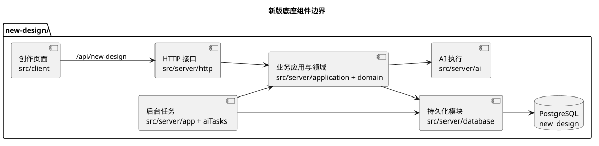

# 新版底座架构总览

## 范围与证据

本篇为 `new-design/` 的结构导航。它归纳已有[新版 README](../../new-design/README.md)、[数据模型](../../new-design/docs/data-model.md)和[独立运行说明](../../new-design/docs/standalone-development.md)中的稳定边界，不复制迁移字段或逐个接口。当前工作区可能有未提交变更；模块与迁移的确切覆盖须按所处理版本重新核对。发现源码只证明存在实现，不证明数据库已迁移、能力已启用或真实创作链通过。

## 组成与依赖方向

新版的 `src/client/` 承接创作页面，`src/server/` 持有 HTTP、业务命令与后台执行，`migrations/` 定义 PostgreSQL `new_design` schema，`runtime/` 和 `scripts/` 承接私有运行包与开发入口。新版服务与页面有自身入口，旧版 `client/`、`server/` 只作为过渡比较和兼容参照，不应成为新版业务数据或模型调用的隐式依赖。[独立运行边界](../../new-design/docs/standalone-development.md)说明启动和隔离要求。

数据与状态的依赖方向是：作者操作／AI 候选 → 专业命令校验 → PostgreSQL 正本及不可变版本／采用记录 → 可重建投影与检索。查询投影不能反向改写正本；后台任务记录执行过程，不复制另一套小说事实。数据库隔离、迁移分层和数据保全见[数据库架构](database.md)，具体表关系与字段以[数据模型](../../new-design/docs/data-model.md)及 SQL 为准。

[PlantUML 源码](diagrams/new-design-components.puml)按 `new-design/src/` 的主要职责画出逻辑依赖，箭头不等于逐文件调用图；图中仅包含新版组件。

## 关键边界

| 边界 | 设计理由与保持项 | 专题依据 |
| --- | --- | --- |
| 资料与书籍 | 公共资料可复用，本书有独立范围；规格和内容版本不随显示名称或公共资源变化而静默重写 | [数据模型](../../new-design/docs/data-model.md)、[资料管理](../../new-design/docs/material-management-and-safe-archive.md) |
| 规划与正文 | AI 结果先是可追溯候选；正式采用指针、事实与后续影响应在明确的结算边界维护 | [章节创作](../../new-design/docs/chapter-writing-workspace.md)、[采用结算](../../new-design/docs/chapter-adoption-settlement.md) |
| 事实、状态与认知 | 正文、书内事实、人物变化及角色知道什么不是同一个对象；后续生成只能读取适用位置的有效版本 | [数据模型](../../new-design/docs/data-model.md)、[章节结算](../../new-design/docs/chapter-adoption-settlement.md) |
| AI 运行 | 任务合同、上下文来源和模型路由在运行前冻结；失败与重入沿原业务请求恢复，不用假生成掩盖失败 | [上下文管理](../../new-design/docs/context-management-and-assembly.md)、[模型运行](../../new-design/docs/model-route-runtime-review.md)、[Outbox](../../new-design/docs/outbox-runtime.md) |
| 派生索引 | AGE 关系图、pgvector 语义索引与视图都服务读取，须能由关系正本重建并遵守书籍范围 | [数据模型](../../new-design/docs/data-model.md)、[检索边界](../../docs/wiki/rag/new-design-semantic-retrieval.md) |
| 数据可移植性 | Git 保存源码与迁移，不保存用户作品数据；迁移作品时同时考虑数据库逻辑备份、受管附件及清单 | [开发交付与跨机器数据](../../new-design/docs/development-delivery.md)、[传输与恢复](../../new-design/docs/transfer-backup-import-export.md) |

## 修改与验收边界

新增能力先定位其专业模块和现有命令，明确正本、候选、采用、回执与下游失效关系；不得在页面、通用 job 或查询投影另造写入规则。涉及旧版兼容时，逐项核对旧作品、深链和用户操作，不把“同仓”理解为共享数据库。改变结构或运行合同须分别证明迁移可用、服务接线和适用业务行为；HTTP 健康或静态构建不能替代整条创作链验收。执行检查时遵守[开发规范](../30规范/development.md)。
