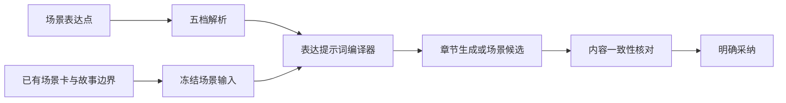

# 通用场景表达轨道设计

## 1. 设计结论

全书编排只增加五条通用的场景表达轨道：

1. 场景节奏
2. 句段节拍
3. 细节展开
4. 镜头距离
5. 语言修饰度

轨道只能绑定已经存在的场景，只保存这个场景的表达档位。它不拥有事件、人物、关系、线索、场景任务、章节目标或正文的写权限。

章节和卷只负责分组、导航与批量选择。即使用户批量设置一章，服务端仍然逐个保存该章现有场景的表达点，不产生章级或卷级轨道值。

保存轨道不会自动改写正文。只有后续正常生成，或者作者明确发起场景重写候选时，提示词编译器才读取表达点。正文仍经过候选、核对和采纳流程。

> 🏠 **白话比喻**：场景内容是一段已经拍好的戏，表达轨道是剪辑台上的速度、镜头远近和调色旋钮。旋钮可以改变观看感受，但不能把演员、台词事实或结局换掉。对应到系统里：轨道只能调整现有场景的讲述方法，故事对象继续由原编排流程管理。
>
> 🧠 **速记方法**：场景定内容，轨道定讲法；保存只存参数，生成才读参数，采纳才改正文。

## 2. 目标与边界

### 2.1 目标

1. 作者能在全书编排中按章节定位场景，并为单个场景设置五种表达档位。
2. 五种维度对所有正常叙事场景都适用，不依赖悬疑、对白、冲突、指定人物或特定题材。
3. 每种维度使用固定五档，档位对应稳定、可审计的标准提示词。
4. 未配置场景继续使用底座原有写法，不增加参数、提示词片段或模型调用。
5. 保存参数、预览候选、核对内容和采纳正文形成完整闭环。
6. 旧作品、旧接口、旧五参数、原八步流程和自动导演行为保持兼容。

### 2.2 轨道允许修改的内容

| 维度 | 只允许调整 |
|---|---|
| 场景节奏 | 已有内容的展开、停顿、转场和行动—反应衔接速度 |
| 句段节拍 | 句子长短、段落切换、语流连续或短促程度 |
| 细节展开 | 已有动作、环境、物件和感官依据的展开程度 |
| 镜头距离 | 叙述对当前视角人物已有感知的贴近程度 |
| 语言修饰度 | 在本书基础文风内使用直述、修饰和意象的程度 |

### 2.3 轨道禁止修改的内容

轨道及其接口不得新增、删除、修改或重排：

- 场景名称、任务、阻力、转折、结束状态和篇幅预算；
- 场景的新增、删除、拆分、合并和排序；
- 事件、事件顺序、因果关系和结果；
- 出场人物、人物行动、决定、能力、关系和知情范围；
- 世界观事实、线索内容、伏笔节点和揭示顺序；
- 章节目标、大纲、卷规划和结局约束；
- 已保存的正式正文；
- 书级写法资产、风格绑定和模型配置。

场景编辑器仍可通过原有功能修改场景本身；表达轨道面板不提供这些入口，也不复用能够写入这些字段的请求合同。

## 3. 为什么只保留五个通用维度

筛选标准为：文学效果明显、模型能够稳定理解、剧情越界风险低、五档容易区分、结果可以从正文证据核对。

| 候选维度 | 结论 | 原因 |
|---|---|---|
| 场景节奏 | 保留 | 适用于所有场景，直接影响阅读推进感 |
| 句段节拍 | 保留 | 适用于所有文本，和场景宏观快慢可以独立组合 |
| 细节展开 | 保留 | 适用于所有场景，但必须限制在已有依据内 |
| 镜头距离 | 保留 | 适用于所有场景，不要求切换视角制度 |
| 语言修饰度 | 保留 | 适用于所有场景，并受书级基础文风约束 |
| 紧张感表达 | 不进入通用轨道 | 平静场景没有既定压力，强行设置容易造冲突 |
| 信息表达密度 | 不进入通用轨道 | 无信息任务的场景没有有效对象，且容易改变揭示节奏 |
| 情绪显性度 | 不进入通用轨道 | 没有明确情绪位移的场景难以稳定执行 |
| 人物聚焦度 | 不进入通用轨道 | 必须绑定具体人物，不属于无对象通用维度 |
| 对白直白度 | 不进入通用轨道 | 无对白场景不适用，且需要保护沟通信息范围 |
| 悬疑、冲突、反转、关系变化 | 禁止作为表达轨道 | 它们直接控制剧情内容和规划 |

段落长度、转场压缩、动作与解释比例等机械参数保留在编译器内部，由五条轨道换算，不作为额外用户轨道。

## 4. 五级字典

### 4.1 统一规则

轨道采用离散的 `L1—L5`，界面节点吸附到五个档位，不向作者展示无法稳定兑现的 `0—100` 伪精度。

- `unset` 表示该场景未设置，完全沿用底座写法。
- `L3` 是作者明确要求“均衡”，不等于 `unset`。
- 档位表示写法方向，不表示文学质量高低。
- 五个维度可以独立设置；未设置的维度不生成提示词。
- 每个场景建议最多设置三条非 `L3` 轨道，界面给出复杂度提示，但不阻止保存。

> 🏠 **白话比喻**：五档像空调的低、中、高风，而不是显示到小数点后的实验室仪器。对应到模型里：清晰的语义档位比“63 和 64”更容易稳定执行。
>
> 🧠 **速记方法**：未设是原样，三级是明确均衡；一到五只代表方向，不代表好坏。

### 4.2 场景节奏

| 档位 | 名称 | 执行含义 |
|---|---|---|
| L1 | 充分舒展 | 完整展开已有观察、动作过程、人物反应和余韵，不能新增事件填充篇幅 |
| L2 | 舒展推进 | 保留较充分的过程和反应空间，转场不过急，不重复解释 |
| L3 | 均衡推进 | 让已有行动、反应和结果均衡交替，不扩成散文，也不压成梗概 |
| L4 | 紧凑推进 | 压缩重复说明、无作用停顿和冗余过渡，让相邻动作衔接更快 |
| L5 | 高度紧凑 | 使用集中段落和直接衔接完成同一事件链，仍保留必要因果与反应 |

固定禁止：增删事件、调换顺序、跳过必要因果、用新冲突冒充快节奏、用重复文字冒充舒展。

### 4.3 句段节拍

| 档位 | 名称 | 执行含义 |
|---|---|---|
| L1 | 连绵舒缓 | 以完整连贯的句群组织已有内容，段落停留更稳定 |
| L2 | 偏长平稳 | 长句和完整段落稍多，保留自然变化，避免拖沓 |
| L3 | 长短均衡 | 长短句和段落切换按语义自然分配 |
| L4 | 短句明快 | 提高短句和短段比例，让动作与判断落点更清楚 |
| L5 | 短促跳切 | 使用短促句段和快速落点形成强节拍，但不得碎裂到难以理解 |

固定禁止：删减必要信息、制造无意义断句、连续堆叠同一种句式、改变事件推进速度来替代语言节拍。

### 4.4 细节展开

| 档位 | 名称 | 执行含义 |
|---|---|---|
| L1 | 必要交代 | 只写理解动作、环境和结果所必需的已有细节 |
| L2 | 轻量点染 | 在必要交代之外选择少量有依据的动作或环境细节 |
| L3 | 均衡描写 | 在推进和细节之间保持均衡，完整呈现关键过程 |
| L4 | 充分展开 | 充分展开已有动作过程、环境反馈和感官依据，不改变事实 |
| L5 | 重点特写 | 对场景任务已经确认的重要过程或物件作集中描写 |

固定禁止：新增物件、文字、数量、证据、人物能力、环境规则或会影响推理方向的感官信息。

### 4.5 镜头距离

| 档位 | 名称 | 执行含义 |
|---|---|---|
| L1 | 客观远景 | 以整体动作和可见结果为主，减少贴身感知停留 |
| L2 | 外部观察 | 以人物外部表现为主，少量承接当前视角允许的感知 |
| L3 | 中距跟随 | 外部行动与当前视角人物已有感知保持均衡 |
| L4 | 贴近感知 | 更多通过当前视角人物的即时注意、身体感受和判断呈现场景 |
| L5 | 沉浸贴身 | 持续贴近当前视角人物已有感知组织场景，但不扩张知情权限 |

固定禁止：切换叙事人称、替换视角人物、进入无权知道的内心、把推测写成客观事实。

### 4.6 语言修饰度

| 档位 | 名称 | 执行含义 |
|---|---|---|
| L1 | 朴素直述 | 使用清楚直接的词句表达已有内容，减少装饰性修辞 |
| L2 | 少量修饰 | 在关键位置加入少量自然修饰，整体保持克制 |
| L3 | 自然均衡 | 直述和修饰按场景需要自然分配，服从本书基础文风 |
| L4 | 鲜明生动 | 使用较鲜明的措辞、节奏和意象强化已有感受 |
| L5 | 浓郁意象 | 在不影响理解和事实的前提下提高意象与修辞浓度 |

固定禁止：模仿具体作者、用比喻确认新事实、破坏人物口吻、覆盖书级风格、堆砌形容词和模板化华丽句。

## 5. 数据模型

### 5.1 固定维度定义

五种定义由代码和 Prompt Registry 注册，数据库不允许新增第六种定义，也不允许作品改写档位含义。

```ts
export type SceneExpressionDimensionKey =
  | "scene_pace"
  | "sentence_cadence"
  | "detail_expansion"
  | "camera_distance"
  | "language_ornament";

export type SceneExpressionLevel = 1 | 2 | 3 | 4 | 5;

export interface SceneExpressionDimensionDefinition {
  key: SceneExpressionDimensionKey;
  label: string;
  description: string;
  bands: Array<{
    level: SceneExpressionLevel;
    name: string;
    instruction: string;
  }>;
  invariants: string[];
  promptAssetKey: "novel.scene.expression_controls";
}
```

### 5.2 场景表达点

```ts
export interface SceneExpressionPoint {
  id: string;
  novelId: string;
  sceneId: string;
  dimensionKey: SceneExpressionDimensionKey;
  level: SceneExpressionLevel;
  note: string | null;
  revision: number;
  createdAt: string;
  updatedAt: string;
}
```

唯一约束为 `(novelId, sceneId, dimensionKey)`。删除一个点表示恢复底座写法，不保存 `inherit` 占位记录。数值 `0`、连续曲线和章级关键点不进入新合同。

### 5.3 矩阵显示偏好

作品可以保存五条轨道的显示顺序、颜色和折叠状态。这些只是界面偏好，不参与提示词：

```ts
export interface SceneExpressionTrackViewPreference {
  novelId: string;
  dimensionKey: SceneExpressionDimensionKey;
  visible: boolean;
  order: number;
  colorToken: "blue" | "orange" | "violet" | "teal" | "rose";
}
```

## 6. 场景绑定与生命周期

### 6.1 绑定规则

- 每个表达点必须引用当前作品中真实存在的稳定场景 ID。
- 章节列只根据场景当前所属章节展示，不进入表达点主键。
- 场景重排后表达点跟随场景 ID，不重新解释为相邻场景的设置。
- 场景删除时，由原场景删除事务同步清理表达点；轨道服务自身不能删除场景。
- 场景拆分或合并时，由原场景编辑器明确处理参数复制或恢复；轨道服务不自动猜测。

### 6.2 章级批量操作

“设置本章场景”属于客户端批量编辑便利功能：

1. 读取该章当前场景 ID 和版本。
2. 预览将修改的场景点。
3. 以一个幂等批次提交多个 `SceneExpressionPoint` 变更。
4. 任一场景版本冲突时整批不写入，返回冲突场景。

它不保存章级默认值，也不影响未来新增到该章的场景。

## 7. 提示词绑定

### 7.1 编译流程



生成整章时，编译器按稳定场景 ID 生成分段要求：

```text
【场景 S1：接单过门槛】
- 场景节奏：L2／舒展推进
- 细节展开：L3／均衡描写

【场景 S2：摸供桌】
- 场景节奏：L4／紧凑推进
- 句段节拍：L4／短句明快
- 镜头距离：L5／沉浸贴身
```

只有已设置的点进入提示词。轨道名称、五档指令和禁止项来自注册字典，数据库只提供场景 ID、档位和作者备注。

### 7.2 优先级

```text
正式事实、人物知情和世界边界
> 章节任务与场景任务
> 出场、事件、转折和结束状态
> 书级基础文风
> 场景表达轨道
> 一般润色偏好
```

轨道和上层约束冲突时，编译器保留上层内容并降低表达目标，不能反向修改故事来达成档位。

### 7.3 固定总约束

每次编译必须附带：

```text
只改变表达，不改变故事。
不得新增、删除、合并或调换事件。
不得改变人物出场、行动、决定、知情、关系、线索、因果和场景结果。
不得补充未提供的姓名、日期、地点、身份、物证内容或结论。
无法在事实边界内达到档位时，以事实为准并降低表现强度。
```

## 8. 运行闭环

### 8.1 保存参数

```text
选择场景点
→ 设置一个或多个五级档位
→ 预览变化和约束
→ 保存表达点
```

保存结束后不调用模型，不修改正文，不更新正式事实，也不触发事件、人物、关系或伏笔同步。

### 8.2 后续生成

原章节生成读取场景卡时，可选读取该场景表达点并注入标准片段。没有任何场景点时，生成模型输入与原流程一致。

### 8.3 已写场景调整

已存在正文时，轨道保存仍不改正文。作者明确点击“预览场景写法”后：

1. 冻结正文版本、场景卡版本和表达点快照。
2. 生成独立候选稿。
3. 核对候选是否保持场景内容。
4. 作者采纳后才沿原 `StateCommit` 能力更新正文。
5. 场景点继续保留，供后续生成和修复读取。

### 8.4 内容核对

核对至少比较：

- 事件集合与顺序；
- 出场人物及行动归属；
- 人物决定、关系和知情范围；
- 世界与物件事实；
- 线索内容和揭示顺序；
- 场景进入状态、转折和结束状态。

任何内容变化都作为阻断问题，不能因为写法档位已达到而自动采纳。

## 9. 界面设计

顶部整书入口保留“表达轨道”，面板标题显示“场景表达轨道”。不提供“新建自定义维度”或剧情轨道入口。

### 9.1 轨道管理

面板固定列出五条系统轨道。作者只能：

- 显示或隐藏轨道；
- 调整轨道顺序；
- 使用项目主题颜色；
- 查看五档解释与内容保护规则；
- 恢复默认显示设置。

显示轨道不代表给任何场景设置参数。

### 9.2 主矩阵

- 章节作为横向分组，每个章节格内按场景顺序显示 `S1、S2、S3…` 子点。
- 每条轨道只在场景子点上显示档位，不显示章级节点。
- 未设置点为空心，已设置点为对应颜色实心并标注 `L1—L5`。
- 单击点打开右侧场景表达面板；拖动点只在五档之间吸附。
- 右键提供“设置档位、复制到所选场景、恢复底座写法”。
- 点击章节标题仍进入原章节或场景管理，不由轨道接管。

### 9.3 右侧编辑面板

面板只显示：

1. 场景编号和名称，只读；
2. 五个通用维度及档位；
3. 每档含义和禁止改变的内容；
4. 当前场景已有任务与结果摘要，只读；
5. 保存参数、恢复底座写法；
6. 已写正文存在时的“预览场景写法”入口。

对象详情继续采用叠层遮罩。关闭最上层只关闭该层，保留下面轨道面板的滚动、筛选、章节窗口和选中场景。

## 10. 接口设计

作品基路径继续使用 `/api/novels/:novelId`。

| 方法与路径 | 用途 |
|---|---|
| `GET /book-arrangement/scene-expression-definitions` | 读取固定五维字典 |
| `GET /book-arrangement/scene-expression-points` | 按可见章节范围读取场景点 |
| `PUT /book-arrangement/scenes/:sceneId/expression-points` | 带版本保存单场景完整表达点 |
| `PUT /book-arrangement/scene-expression-points/batch` | 批量保存多个现有场景的点 |
| `DELETE /book-arrangement/scenes/:sceneId/expression-points` | 恢复该场景底座写法 |
| `POST /book-arrangement/scenes/:sceneId/expression-preview` | 为已写场景生成候选 |

单场景写入合同：

```ts
export interface PutSceneExpressionPointsRequest {
  baseRevision: number;
  controls: Partial<Record<SceneExpressionDimensionKey, SceneExpressionLevel>>;
}
```

请求采用严格 schema。出现事件、人物、场景任务、章节、正文、提示词、模型参数或未知维度字段时返回 `400`。所有写接口要求期望版本和幂等键；重复提交返回同一回执。

## 11. 持久化与兼容

新增一张元数据表：

| 表 | 作用 |
|---|---|
| `SceneExpressionPoint` | 保存场景、固定维度、五级档位、备注和版本 |

轨道显示偏好优先扩展现有全书编排草稿或设置记录，不为颜色和顺序新增业务表。PostgreSQL 与 SQLite 使用相同字段语义和增量迁移。

兼容规则：

1. 保留现有 `WritingControlKey`、章级／书级调整记录及其接口，不迁移、不删除、不改变语义。
2. 新场景表达点使用独立可选合同，只在显式存在时进入模型输入。
3. 旧请求不查询场景表达点，不增加提示词片段和模型调用。
4. 当前 `pinnedTracks` 只作为旧界面显示记录保留，不自动转换成场景表达点。
5. 旧作品不补造场景点，不改写正文和历史证据。
6. 新功能关闭后保留已保存点，运行回到原流程；重新开启后可继续使用。
7. 已冻结的候选继续读取当时的表达点快照，不受后来修改影响。

## 12. 失败与恢复

- 场景不存在或不属于本书：拒绝写入。
- 维度未知或档位不在 `1—5`：拒绝写入。
- 场景或表达点版本冲突：返回当前版本，不覆盖另一窗口修改。
- 批量操作中任一场景冲突：整批不写入并返回冲突列表。
- 候选依赖过期：保留表达点，要求重新生成候选。
- 模型无法在内容边界内达到档位：保留内容并降低表达强度，在预览中提示。
- 内容核对发现越界：阻止自动采纳，表达点不回滚。
- 应用响应丢失：使用同一幂等键读取原回执，不重复写正文。

## 13. 验收标准

### 13.1 数据边界

- 只能写入五种固定维度和 `L1—L5`。
- 每个点只能绑定一个真实场景 ID。
- 轨道接口不能修改任何场景、章节、事件、人物、关系、线索、正文或书级风格字段。
- 删除表达点只恢复底座写法，不删除场景。

### 13.2 界面行为

- 矩阵只出现五条通用轨道，不出现剧情、人物或自定义轨道。
- 章节只分组场景点，不存在章级轨道值。
- 单点、框选场景和本章批量操作最终都保存场景点。
- 右侧面板不提供剧情对象编辑入口。
- 关闭叠层后保留下层位置和选择状态。

### 13.3 提示词与兼容

- 未设置场景不注入额外提示词。
- 同一场景的五档均使用注册字典，不读取用户自由 Prompt。
- 生成、修复、核对读取同一个冻结快照。
- 关闭功能时，旧请求的模型输入、调用次数、保存副作用和返回协议保持基线一致。

### 13.4 内容保持与效果验证

使用动作、对话、调查、过渡、回忆和日常六类固定场景，分别验证五种轨道的 `L1—L5`：

- L1 与 L5 的写法差异应能被盲评稳定识别。
- 相邻档位应表现单调变化，不出现方向反转。
- 事件、顺序、人物行动、知情、线索和结果保持率达到验收阈值。
- 一个维度变化不应显著带动其他未设置维度。
- 模型替身只验合同、版本和副作用；真实模型效果单独记录，不能以接口接通代替效果达标。

首轮真实模型验收目标：内容保持率不低于 `95%`，L1/L5 方向识别率不低于 `90%`，相邻档位方向识别率不低于 `70%`。未达到目标的维度先调整字典或降级，不扩大提示词权限。

## 14. 实施批次

| 批次 | 内容 | 完成条件 |
|---|---|---|
| P0 | 固定五维字典、严格合同、场景表达点与双库迁移 | 能保存场景点，所有剧情字段写入被拒绝 |
| P1 | 矩阵场景子点、右侧编辑面板、单点与批量保存 | 作者能按章节定位并调整现有场景 |
| P2 | 场景提示词编译、冻结快照、生成链路接入 | 未设置时原流程不变，设置后只增加对应场景表达块 |
| P3 | 已写场景候选、内容核对、采纳与恢复 | 参数到候选、核对和采纳形成闭环 |
| P4 | 演示作品填充、真实模型五档评测和界面验收 | 五维效果、内容保持、宽窄屏和刷新恢复有证据 |

每批先验证关闭状态兼容，再验证新增行为。功能默认关闭；显示轨道、保存场景点和应用正文是三个独立动作。
