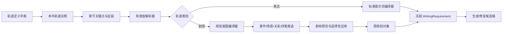

# 动态创作轨道设计

## 1. 设计结论

把现有顶部“表达轨道”升级为“创作轨道”，内部区分两类轨道：

- **表达轨道**：控制既定剧情怎样讲述，只影响节奏、镜头、对白和信息强调，不改变事件、人物决定、因果与结果。
- **剧情轨道**：控制未来剧情怎样规划，只生成事件、场景、关系和伏笔候选；经过影响预览和明确应用后，才修改原规划对象。

轨道采用“定义字典 → 本书实例 → 章节关键点 → 有效值解析 → 受控绑定”的统一模型。用户可以动态新增本书轨道，但不能直接输入一段自由 system prompt，也不能让数值变化绕过候选流程修改正式剧情。

> 🏠 **白话比喻**：创作轨道像游戏里的技能系统。技能字典规定技能名称、五个等级、可以作用的对象和允许产生的效果；玩家可以给当前存档装备技能并调等级，但不能借一个“紧张度”滑块直接改写全部任务结果。对应到系统里：轨道可动态新增，提示词与剧情写入仍经过类型、范围和候选约束。
>
> 🧠 **速记方法**：表达改讲法，剧情改计划；先算本章值，再预览影响，最后才应用。

## 2. 目标与边界

### 2.1 目标

1. 本书可以从标准轨道库添加轨道，也可以创建本书专属轨道。
2. 每种轨道都有完整数据字典，明确名称、档位、对象、绑定、约束和版本。
3. 轨道可以在全书章节轴上设置关键点、区段和渐变，不要求逐章填写。
4. 表达轨道能进入现有可选人工调整提示词，并显示实际来源和生成片段。
5. 剧情轨道能对接现有场景、事件、关系和伏笔服务，生成可选择的规划候选。
6. 原五种写作参数、旧请求、原八步流程和未启用调整时的模型输入保持兼容。
7. 已冻结的写作要求保留当时的字典版本、轨道值和提示词，不被之后的配置修改重写。

### 2.2 不进入本期的能力

- 不允许轨道直接修改 `Chapter.content`。
- 不允许剧情轨道把计划写成已经发生的事实、人物知情或已经回收的伏笔。
- 不增加第二套人物、事件、场景或事实库。
- 不开放任意 system prompt、输出 schema、上下文策略或模型路由给轨道定义覆盖。
- 不用轨道替代已有世界观、人物关系、线索生命周期和章节场景编辑器。

## 3. 概念与总体架构



架构分为六个职责单元：

| 单元 | 职责 | 依赖 |
|---|---|---|
| 轨道字典注册表 | 管理系统字典、本书字典、版本和归档 | Prompt Registry、作品权限 |
| 本书轨道服务 | 启用、命名、颜色、顺序、目标对象 | 轨道字典注册表 |
| 曲线解析器 | 根据稳定章节 ID 解析关键点、区段、继承和渐变 | 章节顺序、锁定状态 |
| 表达编译器 | 把有效值转换为标准写作要求 | PromptAsset、五档字典 |
| 剧情编译器 | 把轨道高低点和转折转换为结构化规划意图 | 大纲、事件、场景、关系、线索 |
| 候选协调器 | 冻结依赖、预览影响、选择应用和恢复回执 | 现有对象候选、版本和幂等能力 |

## 4. 轨道字典

### 4.1 轨道定义字典

```ts
export type CreativeTrackCategory = "expression" | "plot";

export type CreativeTrackTargetType =
  | "chapter"
  | "character"
  | "relation"
  | "hook";

export interface CreativeTrackDefinition {
  id: string;
  key: string;
  ownerScope: "system" | "novel";
  novelId: string | null;
  name: string;
  description: string;
  category: CreativeTrackCategory;
  targetType: CreativeTrackTargetType;
  valueKind: "level_0_100";
  bands: CreativeTrackBand[];
  expressionBinding: ExpressionTrackBinding | null;
  planningBinding: PlotTrackBinding | null;
  revision: number;
  status: "active" | "archived";
  createdAt: string;
  updatedAt: string;
}
```

字段规则：

| 字段 | 规则 |
|---|---|
| `key` | 系统字典使用稳定英文键；本书字典使用不可变 UUID 键，名称可以修改 |
| `ownerScope` | 系统字典只读；本书字典可编辑和归档 |
| `category` | 创建后不可从表达改成剧情，避免旧要求语义漂移 |
| `targetType` | 决定必须绑定的稳定对象 ID，不使用人物名称代替 ID |
| `bands` | 固定五档，数值范围统一为 0—100 |
| `revision` | 修改字典产生新版本；旧候选和旧要求继续引用原版本 |
| `status` | 删除采用归档，不物理删除被历史要求引用的定义 |

### 4.2 五档字典

```ts
export interface CreativeTrackBand {
  level: 1 | 2 | 3 | 4 | 5;
  minInclusive: number;
  maxInclusive: number;
  name: string;
  intent: string;
  readerEffect: string;
  forbiddenExpansion: string[];
}
```

统一档位边界：

| 档位 | 数值 | 语义 |
|---|---:|---|
| L1 | 0—12 | 最弱表达或最低剧情压力 |
| L2 | 13—37 | 轻度 |
| L3 | 38—62 | 均衡 |
| L4 | 63—87 | 强化 |
| L5 | 88—100 | 核心或临界 |

`intent` 描述作者想达到的效果；`readerEffect` 描述期望读者感受到什么；`forbiddenExpansion` 描述本档不能借机增加的内容。它们是结构化槽位数据，不是完整 Prompt。

### 4.3 对象字典

| `targetType` | 必填引用 | 可选限定 | 校验规则 |
|---|---|---|---|
| `chapter` | 无 | 卷、章节范围 | 所有关键点必须属于本书章节 |
| `character` | `characterId` | 场景、视角 | 人物必须属于本书；同名人物按 ID 区分 |
| `relation` | `relationId` | 起点人物、终点人物 | 关系及双方人物必须属于本书 |
| `hook` | `hookId` | 生命周期阶段 | 线索必须属于本书；计划和正文记录分开 |

本期不把事件和场景作为轨道的长期目标对象。事件、场景适合作为剧情轨道产生的候选结果；人物、关系和线索适合作为跨章节持续观察的目标。

### 4.4 表达绑定字典

```ts
export interface ExpressionTrackBinding {
  adapterKey:
    | "narrative_pace"
    | "felt_tension"
    | "information_emphasis"
    | "dialogue_visibility"
    | "camera_prominence";
  promptAssetKey: "novel.chapter.dynamic_track_controls";
  allowedSlots: Array<
    "track_name" | "band_name" | "intent" | "reader_effect" |
    "target_label" | "trend" | "forbidden_expansion"
  >;
  invariants: string[];
}
```

表达适配器是有限字典。用户新增轨道时选择“它主要通过什么方式影响写法”，不能提交自由 system prompt：

| 适配器 | 改变内容 | 固定禁止 |
|---|---|---|
| `narrative_pace` | 篇幅展开、停顿、段落和行动—反应节拍 | 增删事件、跳因果、调顺序 |
| `felt_tension` | 对已有压力、未知和人物感受的强调 | 提高客观危险、增加威胁或反转 |
| `information_emphasis` | 已有信息的叙述位置、停顿和复现 | 新造证据、结论或人物知情 |
| `dialogue_visibility` | 同一沟通内容的明说、暗示和潜台词 | 改变信息量、意图、决定和结果 |
| `camera_prominence` | 镜头、感知细节、动作描写和段落落点 | 新增行动、对白、能力和成果 |

### 4.5 剧情绑定字典

```ts
export interface PlotTrackBinding {
  adapterKey:
    | "conflict_pressure"
    | "revelation_progress"
    | "relationship_shift"
    | "protagonist_agency"
    | "consequence_pressure";
  allowedActions: PlotTrackAction[];
  writtenChapterPolicy: "block" | "candidate_rewrite";
  maxCandidatesPerChapter: number;
  requiredPreserveKinds: Array<"ending" | "fact" | "knowledge" | "locked_object">;
}

export type PlotTrackAction =
  | "adjust_scene_objective"
  | "adjust_scene_conflict"
  | "adjust_scene_turn"
  | "adjust_scene_exit_state"
  | "create_planned_event"
  | "adjust_planned_event"
  | "create_relation_stage"
  | "create_hook_node"
  | "move_planned_hook_node";
```

剧情适配器只输出结构化意图，由现有对象服务生成候选：

| 适配器 | 主要候选对象 | 允许动作 | 默认禁止 |
|---|---|---|---|
| `conflict_pressure` | 场景 | 调整目标、阻力、冲突、转折 | 凭空增加反派、危险或伤亡 |
| `revelation_progress` | 伏笔节点、场景 | 强化、误导、揭示、回收 | 把计划写成已经发现的事实 |
| `relationship_shift` | 关系阶段、场景 | 新建关系目标、安排转折场景 | 直接修改当前事实关系或人物知情 |
| `protagonist_agency` | 场景、计划事件 | 调整行动归属、选择和场景任务 | 抢走他人既定成果、增加未知能力 |
| `consequence_pressure` | 场景退出状态、计划事件 | 明确已有选择的后果和后续压力 | 扩大终局代价、修改锁定结局 |

> 🏠 **白话比喻**：剧情适配器像餐厅菜单里的固定做法。作者可以选择“清蒸、红烧、煎炒”，并调整口味档位，但不能在备注里命令厨房改造煤气管。对应到系统里：动态轨道可以换名称和五档语义，真正能修改的对象与字段仍由适配器白名单控制。
>
> 🧠 **速记方法**：字典定含义，适配器定能力，候选定改动，应用才落库。

## 5. 内置轨道字典

现有五种表达参数保留稳定键，并注册为系统轨道字典。旧 `WritingControls` 继续使用原字段；新轨道实例只是提供统一展示、曲线和来源信息。

### 5.1 表达轨道

| 稳定键 | 名称 | 适配器 | L1 → L5 | 对象 |
|---|---|---|---|---|
| `expression.pace` | 叙述节奏 | `narrative_pace` | 充分舒展、舒展推进、均衡推进、紧凑推进、高度紧凑 | 章节 |
| `expression.tension` | 紧张感表达 | `felt_tension` | 平稳表达、轻微不安、明确压力、强烈紧迫、临界压迫 | 章节 |
| `expression.suspicion_focus` | 疑点强调度 | `information_emphasis` | 轻描、略作提示、清晰强调、重点强调、核心强调 | 人物关系或线索 |
| `expression.dialogue_directness` | 对白直白度 | `dialogue_visibility` | 高度含蓄、多用暗示、半明半暗、大多直说、明确直说 | 人物关系 |
| `expression.character_prominence` | 人物聚焦度 | `camera_prominence` | 背景镜头、少量聚焦、均衡聚焦、重点聚焦、中心聚焦 | 人物 |

### 5.2 剧情轨道

| 稳定键 | 名称 | 适配器 | L1 → L5 | 主要输出 |
|---|---|---|---|---|
| `plot.conflict_pressure` | 冲突压力 | `conflict_pressure` | 无明显阻力、轻微阻碍、明确对抗、强烈压迫、临界选择 | 场景冲突与转折候选 |
| `plot.revelation_progress` | 真相显露度 | `revelation_progress` | 仅留痕迹、提示方向、可验证矛盾、关键揭示、完成回收 | 伏笔生命周期候选 |
| `plot.relationship_temperature` | 关系变化强度 | `relationship_shift` | 稳定背景、轻微松动、明确变化、关键转折、阶段重置 | 关系阶段与场景候选 |
| `plot.protagonist_agency` | 主角主动性 | `protagonist_agency` | 被动承受、开始回应、主动选择、主导行动、承担决定 | 场景任务和行动归属候选 |
| `plot.consequence_pressure` | 后果压力 | `consequence_pressure` | 后果遥远、轻微预示、明确代价、迫近兑现、必须承担 | 退出状态与计划事件候选 |

用户创建本书专属轨道时，必须选择上述十种系统字典之一作为父字典，或者选择一个表达／剧情适配器并完成五档定义。例如“血契真相暴露度”继承 `plot.revelation_progress`，只把目标绑定到血契线索，并调整五档名称和意图。

## 6. 本书轨道、关键点和有效值

### 6.1 本书轨道实例

```ts
export interface NovelCreativeTrack {
  id: string;
  novelId: string;
  definitionId: string;
  definitionRevision: number;
  name: string;
  colorToken: string;
  order: number;
  enabled: boolean;
  targetType: CreativeTrackTargetType;
  targetIds: string[];
  defaultMode: "inherit" | "disabled" | "set";
  defaultValue: number | null;
  revision: number;
}
```

颜色只允许使用项目主题 token，例如 `blue`、`orange`、`violet`、`teal`、`rose`，避免用户保存无法适配亮暗主题的任意 CSS。

### 6.2 关键点字典

```ts
export interface CreativeTrackKeyframe {
  id: string;
  trackId: string;
  chapterId: string;
  mode: "set" | "inherit" | "disabled";
  value: number | null;
  interpolation: "step" | "linear";
  note: string;
  revision: number;
}
```

- `set`：本章设置明确数值。
- `inherit`：从上层默认或前一个有效区段继承。
- `disabled`：本章明确停止该轨道，不能被上级重新启用。
- `step`：保持当前值直到下一个关键点。
- `linear`：在两个关键点之间按阅读顺序线性插值。
- 数值 `0` 是合法值，不能按空值处理。

### 6.3 有效值解析

```ts
export interface ResolvedCreativeTrackValue {
  trackId: string;
  definitionId: string;
  definitionRevision: number;
  chapterId: string;
  mode: "set" | "disabled";
  rawValue: number | null;
  bandLevel: 1 | 2 | 3 | 4 | 5 | null;
  source: "book_default" | "track_curve" | "chapter_override" | "run_override";
  trend: "rising" | "flat" | "falling" | "turning";
  targetIds: string[];
}
```

解析顺序固定为：

```text
本书轨道默认 → 轨道曲线 → 本章覆盖 → 本次写作覆盖
```

后层覆盖前层；`disabled` 覆盖上层启用；本次运行冻结后不再重新解析。轨道趋势由相邻有效章节值计算，只用于提示词说明和剧情候选判断，不写成故事事实。

## 7. 表达轨道作用流程

1. 根据本次章节和稳定章节 ID 读取启用轨道。
2. 解析本章有效值、档位、趋势、对象和来源。
3. 旧五参数映射回现有 `WritingControls`，保持旧提示词语义。
4. 动态表达轨道交给 `novel.chapter.dynamic_track_controls` PromptAsset 渲染标准片段。
5. 合并保留项、章节任务、事实、人物知情和场景边界。
6. 把字典版本、轨道版本、有效值和最终提示词冻结到 `WritingRequirement.chapterRequirements`。
7. 生成、修复、审核和采纳继续使用现有可选人工调整合同。

新增可选合同：

```ts
export interface WritingSettingsPayload {
  enabled: boolean;
  controls: WritingControls;
  dynamicControls?: Record<string, {
    mode: "set" | "inherit" | "disabled";
    value?: number;
    targetIds?: string[];
  }>;
  preserve: string[];
}
```

旧请求没有 `dynamicControls` 时不读取轨道定义、不增加提示词片段、不增加模型调用。

## 8. 剧情轨道作用流程

剧情轨道不直接进入正文 Prompt。它先生成 `PlotTrackIntent`：

```ts
export interface PlotTrackIntent {
  trackId: string;
  chapterId: string;
  bandLevel: 1 | 2 | 3 | 4 | 5;
  trend: "rising" | "flat" | "falling" | "turning";
  adapterKey: PlotTrackBinding["adapterKey"];
  targetIds: string[];
  allowedActions: PlotTrackAction[];
  preserve: Array<{
    kind: "ending" | "fact" | "knowledge" | "locked_object";
    sourceId: string;
    revision: string;
  }>;
}
```

规划 PromptAsset 读取当前章大纲、场景、事件、关系、线索、相邻章节和 `PlotTrackIntent`，输出结构化候选列表。确定性程序随后校验：

- 候选对象和字段是否在 `allowedActions` 白名单内。
- 引用 ID 是否属于本书和目标章节。
- 是否触碰锁章、已写正文、正式事实和人物知情。
- 是否与终局、卷目标、已有因果和伏笔顺序冲突。
- 候选数量是否超过每章上限。

通过校验的候选进入现有预览和应用能力：

| 候选类型 | 复用能力 |
|---|---|
| 场景调整 | `BookArrangementScenePreview` 与场景应用事务 |
| 事件调整 | `BookArrangementObjectPreview` 的 event 分支 |
| 关系阶段 | `BookArrangementObjectPreview` 的 relation 分支 |
| 伏笔节点 | `BookArrangementObjectPreview` 的 hookNode 分支 |

多对象、多章节结果增加批量候选外壳 `arrangement_track_plan`，内部仍保存每个原对象候选及其版本。用户可以逐项取消勾选；应用只提交被选择且仍然有效的对象候选。

已写章节默认 `block`。如果作者明确选择“生成重写候选”，先应用规划候选，再进入现有章节候选、核对和采纳流程；仍不直接覆盖正文。

## 9. 界面设计

顶部入口改为：

```text
整书资料｜人物关系｜线索伏笔｜创作轨道
```

右侧大面板包含：

```text
正在使用｜轨道库｜新增轨道
```

### 9.1 轨道库

- 按表达、剧情、本书自定义筛选。
- 卡片展示名称、类别、对象、五档摘要和作用说明。
- “添加到本书”只创建实例，不立即影响写作。
- 系统轨道可复制为本书轨道；本书轨道可编辑或归档。

### 9.2 新增轨道向导

1. **选择父字典**：选择内置轨道或表达／剧情适配器。
2. **定义基本信息**：名称、说明、颜色、目标类型和稳定对象。
3. **定义五档**：每档名称、作者意图、读者感受和禁止扩张。
4. **配置绑定**：表达方式或允许生成的剧情候选动作。
5. **预览字典**：显示五档提示词摘要、对象范围和禁止项。
6. **保存并添加**：创建本书字典版本与轨道实例，初始没有关键点，不立即生效。

AI 可以协助生成五档文案，但结果必须回填结构化字段并由作者保存。AI 不能生成新的适配器键或扩大字段白名单。

### 9.3 主矩阵轨道行

- 保留不同颜色、空值、合法 0、停用和继承样式。
- 显示轨道名称、类别图标、目标对象和当前状态。
- 单击格子编辑本章值；拖动已有点调整五档。
- 右键提供“设置关键点、建立渐变、保持到下一点、停用、恢复继承、复制到范围”。
- 框选章节后可以批量设置关键点或生成首尾渐变。
- 轨道标题点击打开字典与绑定；不能在矩阵里直接编辑 Prompt。

### 9.4 状态与预览

每条轨道和章节必须显示以下状态之一：

| 状态 | 含义 |
|---|---|
| 草稿 | 轨道或曲线已修改但未保存 |
| 已保存 | 已持久化，但尚未产生应用候选 |
| 待应用 | 已生成表达或剧情候选 |
| 已应用 | 当前版本已经进入有效设置或原规划对象 |
| 本章覆盖 | 本章设置覆盖轨道曲线 |
| 已停用 | 本章明确阻止继承 |
| 已过期 | 字典、章节或依赖版本变化，需要重新预览 |
| 有冲突 | 触碰锁定、正文、因果、目标对象或范围边界 |

表达预览展示实际提示词片段、来源和覆盖关系。剧情预览展示“轨道要求 → 候选对象 → 修改前后 → 影响章节 → 未检查范围”。

详情采用叠层右侧面板：打开字典、对象或候选详情时，下面的创作轨道页面保持挂载；关闭只关闭最上层，滚动、筛选、章节窗口和关键点选择不变。

## 10. 接口设计

作品基路径继续使用 `/api/novels/:novelId`。

| 方法与路径 | 用途 |
|---|---|
| `GET /creative-track-definitions` | 读取系统字典和本书字典 |
| `POST /creative-track-definitions` | 创建本书字典 |
| `PUT /creative-track-definitions/:definitionId` | 基于期望版本创建新字典版本 |
| `POST /creative-track-definitions/:definitionId/archive` | 归档本书字典 |
| `GET /book-arrangement/tracks` | 读取本书轨道、关键点、有效值和状态 |
| `POST /book-arrangement/tracks` | 从字典创建本书轨道实例 |
| `PATCH /book-arrangement/tracks/:trackId` | 修改名称、颜色、顺序、启停和目标 |
| `PUT /book-arrangement/tracks/:trackId/keyframes` | 带版本保存完整关键点集合 |
| `POST /book-arrangement/tracks/expression-preview` | 冻结表达设置候选 |
| `POST /book-arrangement/tracks/plot-preview` | 生成并冻结剧情规划候选 |
| `POST /book-arrangement/tracks/:candidateId/apply` | 选择性应用表达或剧情候选 |

所有写接口要求 `Idempotency-Key` 和期望版本。预览保存章节、轨道、字典、对象和依赖版本；应用前重新校验。重复提交返回同一回执。

## 11. 持久化设计

新增元数据表：

| 表 | 作用 |
|---|---|
| `CreativeTrackDefinition` | 保存系统／本书字典、版本、五档和绑定配置 |
| `NovelCreativeTrack` | 保存本书启用轨道、显示和目标对象 |
| `CreativeTrackKeyframe` | 保存稳定章节 ID 上的关键点 |

候选继续复用 `ChapterEditVersion`，通过 `kind = arrangement_track_expression | arrangement_track_plan` 区分。正式表达设置继续写入 `WritingSetting`；剧情候选应用到原事件、场景、关系和伏笔节点表。

PostgreSQL 与 SQLite 使用同一字段语义和增量迁移。迁移只注册系统字典并转换当前 `pinnedTracks` 的显示选择，不改写旧作品正文，也不把现有曲线自动声明为已应用。

## 12. Prompt Registry 设计

新增两个注册资产：

| PromptAsset | 输入 | 输出 |
|---|---|---|
| `novel.chapter.dynamic_track_controls` | 已解析表达轨道、五档字典、对象标签和硬边界 | 可注入章节写作的受控文本块 |
| `novel.arrangement.track_plan` | 剧情轨道意图、真实规划对象、章节上下文和保留项 | 结构化对象候选列表 |

字典只能修改 PromptAsset 已声明的槽位：轨道名、档位名、意图、读者效果、对象标签、趋势和禁止扩张。`system`、`contextPolicy`、结构化 schema、后校验和语义重试策略保持代码注册，不能由数据库字典覆盖。

规划结果的文学和因果判断由注册 PromptAsset 完成；程序负责 ID、类型、字段白名单、版本、范围、锁定和数量校验，不能用关键词规则冒充剧情理解。

## 13. 兼容与迁移

1. 保留 `WritingControlKey` 和现有五参数实现。
2. `WritingSettingsPayload.dynamicControls`、工作区轨道字段和新接口全部可选。
3. 旧请求没有调整合同时，不查询动态轨道、不渲染片段、不增加模型调用。
4. 当前 `pinnedTracks` 迁移成系统轨道的显示状态；原章级 `controls` 仍是有效数据来源。
5. 旧候选、旧审核和旧要求不补造轨道版本。
6. 字典归档不删除历史引用；编辑字典产生新版本。
7. 章节重排、对象修改或字典升级会使未应用候选过期，但不会修改已经冻结的运行输入。

## 14. 失败与恢复

- 字典版本冲突：保留当前输入，展示服务器版本并要求重新比较。
- 目标对象失效：轨道保留但标记“目标缺失”，停止生成候选。
- 关键点章节失效：保留关键点记录，标记待重新定位，不自动移动到相邻章节。
- Prompt 输出结构失败：按 Prompt Registry 的 repair 与 semantic retry 处理；达到上限后保留候选输入并返回失败。
- 部分剧情候选过期：允许重新预览；不能用仍有效的一项证明整批仍有效。
- 应用响应丢失：使用同一幂等键读取原回执，不重复写入对象。
- 同步失败：只补未完成的资料同步，正文和原规划对象不重复应用。

## 15. 验收标准

### 15.1 动态字典

- 能从系统字典创建轨道，能创建本书专属名称和五档。
- 不合法档位、未知适配器、跨作品对象和自由 Prompt 字段被拒绝。
- 字典更新形成新版本，旧要求仍能按原版本读取。
- 归档轨道不出现在新增列表，历史候选仍可查看。

### 15.2 曲线与继承

- `0`、空值、继承、停用和恢复继承分别正确。
- 阶梯和线性插值在章节尾窗、缺口和重排后保持稳定 ID 语义。
- 本章覆盖和本次覆盖按固定优先级生效。
- 运行中修改曲线不改变已经冻结的要求。

### 15.3 表达闭环

- 动态表达轨道能显示实际值、档位、趋势、对象、来源和提示词预览。
- 生成、修复、审核读取同一个冻结要求。
- 只启用表达轨道时，事件、场景、关系、伏笔和正文保存行为不产生额外副作用。
- 关闭功能后旧生成请求的模型输入与调用次数保持基线一致。

### 15.4 剧情闭环

- 剧情轨道只产生候选，不直接修改原规划和正文。
- 候选只包含适配器允许的对象和字段。
- 选择性应用只修改勾选对象，其他计划保持不变。
- 已写章节默认拒绝直接应用；明确进入重写候选后仍需核对和采纳。
- 应用规划后旧要求因依赖版本变化而过期，重新解析后读取新规划。

### 15.5 界面与性能

- 宽窄屏均在右侧面板编辑，不要求滚到主页面下方。
- 叠层详情关闭后保留原轨道页滚动、筛选、章节窗口和选择状态。
- 500 章、20 条启用轨道下，章节窗口只解析和渲染可见范围；全书预览在服务端分批计算。
- 键盘可到达轨道、关键点、菜单和关闭按钮；颜色之外同时显示文字和图标状态。

## 16. 实施批次

| 批次 | 内容 | 可独立验收的结果 |
|---|---|---|
| P0 | 字典、实例、关键点、版本、系统轨道迁移 | 可以动态新增轨道并保存曲线，尚不进入模型 |
| P1 | 有效值解析、表达 PromptAsset、要求冻结、来源展示 | 动态表达轨道完整作用于候选写作 |
| P2 | 剧情意图、规划 PromptAsset、批量候选和对象适配 | 动态剧情轨道生成可审查规划候选 |
| P3 | 选择应用、过期恢复、已写章节重写入口、影响回查 | 轨道到规划、写作、核对和采纳形成闭环 |
| P4 | demo 字典、真实界面验收、性能与模型效果记录 | 《净宅人翻旧账》可完整体验并验证边界 |

每批先验证旧流程兼容，再验证新增行为。功能开关关闭后保留轨道记录，后续任务回到原流程；已经明确应用的规划或正文通过正常版本修改处理，不随功能关闭自动撤销。
