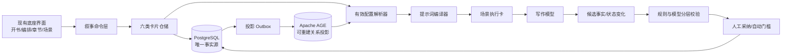

# 叙事控制内核与 PostgreSQL + Apache AGE 目标架构

> 状态：已确认的目标设计，尚未完成数据库切换与 AGE 接入。
>
> 范围：在现有 AI 小说底座上建设统一的卡片、提示词编译、生成、核对和状态提交闭环；不重做现有创作界面，不把图数据库当第二份事实源。

## 1. 结论

保留现有作品、全书编排、章节、场景、候选比较、核对与采纳流程，替换其下方分散的“资料拼接方式”，形成一个叙事控制内核：

1. PostgreSQL 作为唯一正式数据库和唯一事实源。
2. Apache AGE 作为 PostgreSQL 内的图查询扩展，只保存可重建的关系投影。
3. 用事实卡、计划卡、状态卡、表达卡、执行卡、校验卡统一不同阶段的数据职责。
4. 每次只为一个场景解析有效配置并编译执行卡，写作模型只读取执行卡。
5. 生成后先抽取候选变化，再校验、人工采纳并提交状态；失败稿不能污染后续章节。
6. 默认由 AI 生成计划和参数，作者主要做查看、锁定、局部修改与差异化微调。

> 🏠 **白话比喻**：PostgreSQL 是档案室里的原始卷宗，AGE 是贴在墙上的人物关系图。墙上的线可以随时重画，但不能反过来偷偷修改卷宗。六类卡片像“事实档案、行程计划、当前值班表、导演要求、当天通告单、质检报告”，每张只做自己的事。
>
> 🧠 **速记方法**：一库、一真、一场景、一执行包、一验收提交。对应关系：PostgreSQL 是一库与一真，场景是生成最小单元，执行卡是唯一模型输入，校验通过后才提交新状态。

## 2. 为什么在底座上构建，而不是重做

现有系统已经有作品、角色、世界观、卷章规划、场景卡、全书编排、表达轨道、提示词注册、候选版本、核对结果和明确采纳。这些是有价值的业务入口，问题主要在底层：

- 同一要求可能同时来自任务单、场景卡、人工调整、表达轨道和旧正文，缺少统一优先级。
- 故事事实、未来计划、当前状态与写法参数容易混入同一个提示词，模型难以判断哪些能改。
- 一次生成整章时，后段场景容易被前段要求挤出上下文或漏写。
- 生成后虽然有核对，但缺少“候选状态变化 → 冲突校验 → 正式提交”的完整事务。
- 关系查询需要跨人物、物件、线索、地点、时间和知识边界，但不能因此维护第二份正式数据。

因此采用“保留外壳、重建内核”的方式。现有页面逐步改为读写六类卡片和解析结果，旧字段通过适配器继续可用，避免一次性重写造成业务倒退。

## 3. 架构边界



### 3.1 唯一事实源

关系表和卡片表中的正式版本是事实源。AGE 不拥有业务写入口，不允许直接由 Cypher 修改人物状态、物件归属或章节事实。图损坏、延迟或不可用时，生成链路仍能从关系表降级运行。

### 3.2 每书隔离、全局复用

- 作品数据、图节点和图边都必须带 `novel_id`。
- 查询首先按作品授权和 `novel_id` 限定，再进入图遍历。
- 卡片类型、字段规范、校验规则、提示词资产、Skill 和模板可全局复用。
- 默认每部作品建立独立 AGE graph；如实测发现图数量管理成本过高，可改为共享 graph + 强制 `novel_id` 属性，但仍不能跨书查询正文事实。

### 3.3 非目标

- 不建设分布式数据库、独立图数据库集群或跨区域复制。
- 不让模型直接写数据库或直接执行 Cypher。
- 不把全部正文拆成图节点；图只投影需要关系遍历的实体与事实。
- 不用一个无限增长的“大提示词”承载全书资料。
- 不保证所有参数都能精确控制文学效果；无法稳定验证的参数不得成为默认硬约束。

## 4. 六类卡片

| 卡片 | 负责什么 | 典型内容 | 谁可修改 | 是否进入正文模型 |
|---|---|---|---|---|
| 事实卡 | 已确认且不能被本次生成擅改的真相 | 世界规则、身份、物件属性、已发生事件、已揭示证据 | 作者或采纳事务 | 按场景相关性裁剪后进入 |
| 计划卡 | 尚未发生的创作意图 | 全书承诺、卷目标、章节目标、场景动作、伏笔计划 | 作者、规划 AI 候选 | 仅当前场景有效部分进入 |
| 状态卡 | 写到当前时点的运行状态 | 所在地、持有物、关系阶段、已知信息、伤势、未偿承诺 | 采纳事务 | 只读快照进入 |
| 表达卡 | 只改变讲法 | 节奏、句段、细节、镜头、修饰度、对白倾向 | 作者或 AI 建议 | 低于故事约束进入 |
| 执行卡 | 某一场景的唯一执行合同 | 输入快照、目标、边界、可自由区、输出格式、自检 | 系统编译 | 是，且是唯一直接输入 |
| 校验卡 | 记录候选稿问题和证据 | 事实冲突、动作缺失、知识越界、表达偏差、修复建议 | 程序与审查模型 | 不进入首次生成；重试只注入必要问题 |

### 4.1 通用卡片信封

所有卡片共享固定字段，保证审计和覆盖关系可计算：

```ts
interface CardEnvelope {
  id: string;
  novelId: string;
  cardType: "fact" | "plan" | "state" | "expression" | "execution" | "validation";
  scopeType: "global" | "book" | "volume" | "chapter" | "scene";
  scopeId: string | null;
  sourceType: "author" | "accepted_text" | "ai_candidate" | "system" | "migration";
  sourceId: string | null;
  schemaKey: string;
  schemaVersion: number;
  status: "candidate" | "active" | "superseded" | "rejected";
  locked: boolean;
  priority: number;
  validFromOrder: number | null;
  validToOrder: number | null;
  revision: number;
  payload: Record<string, unknown>;
  createdAt: string;
  updatedAt: string;
}
```

固定字段用于授权、版本、范围和冲突解析；各类卡片的核心字段进入类型化列或子表；低频扩展放 `JSONB`。`JSONB` 不是“什么都往里塞”的垃圾袋，独立查询、唯一性、外键和并发更新频繁的字段必须关系化。

> 🏠 **白话比喻**：固定字段像快递面单，保证每个包裹都知道属于哪本书、哪一章、谁寄出、是否锁定；`JSONB` 像箱内可变化的物品清单。经常要单独查验的身份证和收货人不能只藏在箱子里。
>
> 🧠 **速记方法**：常查常约束进列，偶发扩展进 JSONB；一个可独立修改的事实就是一条原子记录。

### 4.2 类型化核心

- `NarrativeEntity`：人物、地点、组织、物件、线索、规则、事件、场景。
- `NarrativeFact`：主体—谓词—客体/值、置信状态、生效章序、来源证据。
- `NarrativePlan`：目标范围、前置条件、必须推进、禁止扩展、预期终态。
- `NarrativeState`：实体、状态键、值、观察时点、来源版本。
- `ExpressionSetting`：维度、档位/枚举、作者备注、作用域。
- `ExecutionPacket`：冻结输入哈希、采用卡片、解析决议、提示词资产版本、模型参数。
- `ValidationResult` / `ValidationIssue`：规则、严重级别、定位证据、期望来源、处置状态。

### 4.3 道具卡是否需要

需要，但它不是第七类顶层卡。道具属于事实卡和状态卡的专门 schema：

- 不变属性：名称、唯一性、外观、功能边界、是否能作为证据。
- 可变状态：持有人、所在地点、完整度、可见性、已知者、最后变化场景。
- 事件关联：获得、移交、损坏、使用、发现、封存。
- 约束：同一时点唯一持有人、不可凭空复制、功能不能超出事实卡。

这样既能控制道具一致性，又不会让“道具”与人物、地点、线索各自演化出不兼容的卡片系统。

## 5. 优先级与唯一有效值

解析器必须为每个场景输出唯一的有效合同，并保留被覆盖项和覆盖原因。

### 5.1 不同领域分开排序

```text
事实：作者锁定 > 已采纳正文事实 > 作者明确修订 > AI候选
计划：场景 > 章节 > 卷 > 全书 > 模板
表达：场景 > 章节 > 卷 > 全书 > 模板
运行状态：最近一次已采纳场景 > 更早状态 > 初始化状态
```

不同领域不能互相覆盖：表达卡不能改事实，计划卡不能把未来写成历史，旧正文不能否决作者本次明确重编排。

### 5.2 冲突策略

1. 同键、同范围、同优先级且值不同：阻断编译，要求作者选择或由明确的上级规则裁决。
2. 高优先级覆盖低优先级：保留审计记录，执行包只使用胜出值。
3. 事实与计划冲突：事实胜出，计划标记不可执行。
4. 表达要求会导致剧情变化：降低或停用该表达项，不修改故事来满足参数。
5. 输入缺失：允许自由区自然表达，但禁止补造会影响判断的新事实。

每条决议保存 `winner_card_id`、`loser_card_ids`、`rule_key` 和 `reason`，便于界面解释“为什么本场使用这个值”。

## 6. 受控区与自由区

### 6.1 必须受控

- 人名、身份、数量、时间、地点和方向。
- 人物出场、行动主体、决定、知情边界与关系阶段。
- 物件属性、持有人、去向、唯一性与损坏状态。
- 证据内容、线索揭露时机、世界规则、因果和事件结果。
- 场景进入状态、必须动作、转折和离场状态。

### 6.2 可自由发挥

- 不承担新因果的气氛、感官、微动作和自然过渡。
- 不改变行动、知情、关系和结果的对白措辞。
- 在表达卡边界内的句长、段落、镜头远近、详略和修辞。

判断规则：删除这段自由补充后，人物为何行动、如何选择、得知什么以及场景结果都应保持不变。否则它就是新故事事实，必须先进入候选卡和校验流程。

## 7. 提示词编译器

不保存一个通用大 Prompt，而是保存可版本化的提示词资产与方法卡，在运行时编译短执行包。

### 7.1 输入层次

```text
L0 系统安全与输出协议
L1 已解析的事实合同
L2 当前状态与人物知识边界
L3 当前场景计划：目标、阻力、动作、结果
L4 当前场景表达合同
L5 自由发挥边界
L6 输出格式、篇幅和逐项自检
```

执行卡必须记录每一层采用了哪些卡片及其版本。正文模型不再直接读取整本数据库、原始页面 JSON、冲突配置或核对历史。

### 7.2 通用写作指令骨架

```text
任务：把已确认的场景安排写成小说正文，不解释配置。

事实：只使用 FACT_CONTRACT 中的已确认事实；缺失信息不补成证据、规则或结论。
状态：以 ENTRY_STATE 为开场，人物只能使用 KNOWLEDGE_BOUNDARY 内的信息。
推进：完成 REQUIRED_ACTIONS 与 EXIT_STATE；不得用相似动作、提及名词或总结替代实际发生。
表达：执行 EXPRESSION_CONTRACT；它只能改变讲法，不能改事件、行动、知情、关系、因果和结果。
自由：可补自然对白、微动作、气氛、感官与过渡，但删除这些补充后动机、选择、信息和结果必须不变。
篇幅：在 LENGTH_BUDGET 内优先保证事实、因果和场景完成；不得为凑字新增事实。
输出：只输出本场正文，不输出分析、标题、JSON 或配置术语。
```

这段骨架本身不含具体剧情；实际内容全部来自执行卡的结构化槽位。

### 7.3 模型参数

默认按任务而非题材配置：

| 任务 | temperature | 说明 |
|---|---:|---|
| 抽取、解析、校验 | 0.1 | 优先稳定、可复现 |
| 规划候选 | 0.3—0.5 | 允许有限方案差异 |
| 正文写作 | 0.6 | 保留表达变化，不放宽事实 |
| 表达层改写 | 0.4—0.6 | 只在冻结内容上变化 |

模型不支持温度或有固定温度要求时，由现有能力路由层覆盖；参数不能写进剧情卡。是否使用多个候选由成本策略决定，默认只对高风险或首次整章生成启用。

## 8. 完整生成闭环

```text
AI生成全书/卷/章/场景卡候选
→ 作者查看、微调、锁定
→ 解析唯一有效配置
→ 每场编译执行卡并冻结版本
→ 生成场景正文候选
→ 程序抽取候选状态变化
→ 硬规则校验
→ 独立审查模型核对软问题
→ 失败则按问题定向重试或交给作者
→ 作者采纳
→ 同一事务提交正文版本、事实/状态变化、审计和图投影事件
→ 下一场读取新状态
```

### 8.1 为什么按场景生成

场景是同时拥有明确进入状态、动作、结果和表达目标的最小闭环。按场景生成能减少长上下文竞争，并让状态在下一场前得到提交。章节仍是作者浏览、比较和最终采纳的常用单位；系统可以串行生成多个场景后组装章节候选，但内部不能把全章当一个无边界请求。

### 8.2 校验分层

1. 程序硬校验：结构、唯一值、版本、字数范围、人物/物件引用、知识边界、必做项覆盖。
2. 图查询校验：多跳关系、时间可达性、物件流转、线索知情路径。
3. 审查模型：表达质量、隐性逻辑、人物声音、总结腔与机械表达。
4. 人工决定：接受、局部修、重新生成、修改上游卡片。

模型审查不能把自己的判断直接写成正式事实；任何建议先进入校验卡。

## 9. PostgreSQL 与 AGE 数据策略

### 9.1 PostgreSQL

- 关系列保存稳定身份、范围、状态、版本、锁和引用。
- `JSONB` 保存低频、可演进但有 schema version 的 payload，并按真实查询增加 GIN 或表达式索引。
- 唯一约束保证同一范围的有效状态不会出现两份“官方答案”。
- 外键保证卡片不能引用其他作品的场景或实体。
- 乐观版本与事务锁防止两个窗口或后台任务互相覆盖。
- 企业部署可用 Row Level Security 作为第二道隔离，但应用层授权仍不可省略。

> 🏠 **白话比喻**：乐观版本像两个人同时改同一份表格，后保存的人必须先确认版本号没有变化；事务锁像档案员暂时把正在办理的卷宗扣在窗口；行级安全像门卫按员工权限决定能看哪一排档案。对应到数据库里，它们分别防止旧版本覆盖、并发交叉写入和越权读取。
>
> 🧠 **速记方法**：版本防旧、事务防抢、RLS 防串书；三者都不能替代应用层授权。

### 9.2 Apache AGE

投影节点建议：`Character`、`Location`、`Organization`、`Prop`、`Clue`、`Rule`、`Event`、`Scene`。

投影边建议：`PARTICIPATES_IN`、`KNOWS`、`HOLDS`、`LOCATED_AT`、`RELATED_TO`、`CAUSES`、`REVEALS`、`CONTRADICTS`、`PRECEDES`、`REQUIRES`。

所有节点和边包含：`novel_id`、`source_record_id`、`source_revision`、`valid_from_order`、`valid_to_order`。图写入只消费事务 Outbox；投影器幂等 upsert，失败可重放。图查询结果必须回到关系表校验版本，不能单凭图结果生成正文。

> 🏠 **白话比喻**：Outbox 像档案室盖章后放进传达盒的复印通知。关系图管理员只按通知更新墙图；漏贴可以补贴，墙图全掉了也能从卷宗重画。
>
> 🧠 **速记方法**：先落库，后投影；图可丢，真相不可丢。

### 9.3 版本选择与开源边界

- PostgreSQL 使用官方支持版本；AGE 必须选择与 PostgreSQL 主版本明确匹配的正式发布，不追未验证的主分支。
- 建议首个验证组合为 PostgreSQL 17 + 对应 AGE 1.7.x 正式版；上线前以预发布镜像、升级脚本和回滚演练为准。
- PostgreSQL 使用 PostgreSQL License，Apache AGE 使用 Apache License 2.0，均可免费自建；仍需保留对应许可证和 NOTICE。
- AGE 版本与 PostgreSQL 主版本耦合较强，升级必须作为一个兼容矩阵测试，不能只升级其中一方。

## 10. 与现有代码的落点

| 现有能力 | 保留方式 | 目标改造 |
|---|---|---|
| `book-arrangement` | 保留统一章节轴和右侧面板 | 写入计划卡/表达卡，不直接拼 Prompt |
| 场景表达轨道 | 保留动态轨道和书级启用 | 解析为场景表达合同，永远低于故事事实 |
| `WritingSettingsService` | 保留人工调整入口 | 改为卡片命令与有效值预览 |
| `WritingContentService` | 保留候选、核对、采纳外观 | 拆为 resolver、compiler、generator、validator、commit coordinator |
| `prompting/` | 继续作为产品 Prompt 唯一入口 | 新增版本化 prompt compiler 与 execution packet 渲染 |
| 现有事实账本/关系阶段 | 作为迁移来源 | 映射到类型化事实/状态并投影图 |
| SQLite | 只用于迁移期兼容 | 目标正式链路移除，不承载叙事图能力 |

不得继续把新流程堆入一个大型 Service。目标模块：

```text
modules/novel/narrative-control/
  application/commands/
  domain/cards/
  domain/resolution/
  domain/validation/
  infrastructure/postgres/
  infrastructure/age/
  prompting/
```

## 11. 迁移与发布

### 阶段 A：合同先行

- 定义六类卡片 schema、优先级、冲突原因和执行卡 JSON Schema。
- 用现有字段做只读适配，不改变现有生成结果。
- 建立五题材固定样本和旧链路基线。

### 阶段 B：PostgreSQL 单库切换

- 新安装从第一天只创建 PostgreSQL 数据库。
- 为既有 SQLite 用户提供一次性导出、校验、导入、行数/哈希对账和可回退备份。
- 未完成迁移时禁止启用 AGE 与新叙事内核，不做双写长期运行。

### 阶段 C：卡片内核与场景执行

- 现有数据映射到候选卡，作者确认后激活。
- 场景级 resolver、execution packet、候选 delta 和事务提交上线。
- 旧整章链路保留为可回退开关，不能与新链路同时提交状态。

### 阶段 D：AGE 投影

- 安装固定版本扩展，建立每书图和 Outbox 投影器。
- 先用于只读查询与校验；实测稳定后再用于上下文选择。
- 任何 AGE 故障都降级到 PostgreSQL，不阻断作者读取和手工编辑。

### 阶段 E：默认启用

- 五题材对照验证达到门槛。
- 完成 PostgreSQL 备份恢复、AGE 重建、版本升级和故障演练。
- 新内核成为默认，旧适配器进入移除清单。

## 12. 验收标准

### 数据与冲突

- 每个有效范围和控制键只有一个解析结果，且能解释覆盖来源。
- 事实、计划、状态、表达互相不能越权写入。
- 图删除后可从关系表完整重建，重建前后关键查询一致。
- 跨作品引用在应用层、外键/约束层和图查询层均被拒绝。

### 生成与一致性

- 正文模型只接收冻结的单场景执行卡。
- 必做动作不能用相关名词或相似动作冒充完成。
- 物件数量、持有人、知识边界、事件顺序和场景终态的硬错误不高于旧基线。
- 表达参数变化不能改变故事事实；无法兼得时自动降低表达强度。
- 失败候选不更新正文、事实、状态或 AGE 投影。

### 五题材验证

民俗悬疑、凡人修仙、现代言情、科幻末世、历史权谋分别使用同模型、温度、输入和长度预算，对比旧链路与新链路。候选机制只有在至少四类优于或持平、没有题材显著退化且硬约束错误不增加时，才进入默认流程。

### 运维

- PostgreSQL 备份可恢复，恢复后卡片版本和正文哈希一致。
- AGE 可从 Outbox 或关系表全量重建，不要求恢复第二份独立备份。
- 每次调用可追溯执行卡、Prompt 版本、模型参数、输出版本、校验卡和采纳人。

## 13. 主要风险与处置

| 风险 | 处置 |
|---|---|
| AGE 版本跟随 PostgreSQL 较慢 | 固定兼容组合；升级前跑完整回归；保留纯 SQL 降级查询 |
| 图与关系表短暂不一致 | Outbox、幂等投影、revision 校验；图不作事实源 |
| 卡片过多导致提示词膨胀 | 场景相关性筛选、唯一解析、token 预算和来源摘要 |
| AI 自动生成卡片产生伪事实 | 默认 candidate；作者锁定或正文采纳后才 active |
| 表达卡偷偷改变剧情 | 类型隔离、固定保护规则、生成后事实 delta 比较 |
| 一次性数据库切换失败 | 导出/导入对账、只读演练、可恢复备份；不做长期双写 |

## 14. 官方依据

- [PostgreSQL JSON/JSONB 文档](https://www.postgresql.org/docs/current/datatype-json.html)：`JSONB` 支持索引，但文档也建议保持可预测结构并控制单个文档大小。
- [PostgreSQL 行级安全策略](https://www.postgresql.org/docs/current/ddl-rowsecurity.html)：可作为企业作品隔离的数据库侧补充。
- [PostgreSQL 约束文档](https://www.postgresql.org/docs/current/ddl-constraints.html)：唯一、检查和外键约束用于守住正式数据合同。
- [Apache AGE 概览](https://age.apache.org/overview/)：AGE 是 PostgreSQL 图扩展，支持在事务存储上执行图查询。
- [Apache AGE Cypher 调用格式](https://age.apache.org/age-manual/master/intro/cypher.html)：Cypher 通过 PostgreSQL 函数调用，适合封装在基础设施适配器内。
- [Apache AGE 发行页](https://github.com/apache/age/releases)：选择与 PostgreSQL 主版本匹配的正式版本，不直接依赖 master。

## 15. 30 秒回忆

- 不重做底座，重建叙事控制内核。
- PostgreSQL 是唯一真相；AGE 只做可重建关系图。
- 六卡分责：事实、计划、状态、表达、执行、校验。
- 每个场景先解析唯一配置，再编译唯一执行卡。
- AI 生成的是候选；核对和采纳后才改变正式状态。
- 表达可以自由，故事事实不能被参数偷改。
