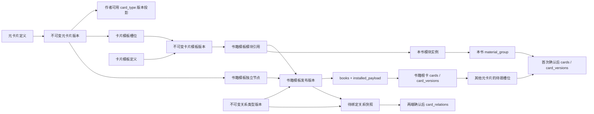

# 元卡片、卡片模板与书籍模板数据库设计

## 文档状态与现有基础

本文是[功能设计](card-template-feature-design.md)的**目标数据合同**。对应的追加式迁移已写入源码，但不表示已在作者数据库应用或页面完成验收。依据为新版 `card_types`／`card_type_versions`、`cards`／`card_versions`、内部记录卡、`template_group`／`template_group_version`、`books.installed_payload`、书内 `material_group` 及现有开书事务。最终物理结构和已运行行为以实际迁移账本、当前 `migrations/` 与[数据字典](data-model.md)为准，不把原型的 `localStorage` 当正式数据库。

新版已经用内部卡片的 `values` 保存模板组、组合表单和许多业务记录。新增定义沿用这一模型，避免在卡片内核旁另建一套完整业务表。`books` 继续承载书籍聚合 ID、空间和模板来源；**书籍基础信息本身另是一张正式作者卡**，与 `books` 一对一绑定，并作为画布唯一根节点。原有开书请求依旧引用 `templateVersionId`。书籍模板在界面上是新层级，在底层扩展现有模板组发布负载，历史模板版本保持可读。

## 逻辑模型与身份

| 逻辑对象 | 目标正本与关键属性 | 身份／版本关系 |
| --- | --- | --- |
| 元卡片定义 `meta_card` | 系统空间的内部记录卡：`id`、唯一 `key`、名称、分类、说明、`draftFields`、`status`、`revision`、`currentVersionId` | 一个稳定 ID；草稿可修订，发布版本不可变 |
| 元卡片版本 `meta_card_version` | 内部记录卡：`id`、`metaId`、递增 `version`、冻结 `fields`、字典／选项来源快照、`contentHash`、投影的 `cardTypeVersionId` | 一个版本属于一个元卡片；字段 key 在该版本内唯一 |
| 卡片模板定义 `card_template` | 系统空间的内部记录卡：`id`、唯一 `key`、名称、分类、说明、`draftGraph`、`status`、`revision`、`currentVersionId` | 草稿图与发布版本分开 |
| 卡片模板版本 `card_template_version` | 内部记录卡：`id`、`templateId`、`version`、成员槽位、带类型关系线、布局、`contentHash` | 每个成员引用**确切** `meta_card_version.id`；同一来源可多次出现但槽位 ID 不同 |
| 关系类型版本 `relation_type_versions` | 新增不可变版本表：`id`、`relation_type_id`、`version`、冻结的关系 key、名称、方向、允许的源／目标类型、数量限制、属性字段规格、`definition_hash`、`source_version_id?`、发布时间 | `(relation_type_id, version)` 唯一；模板边引用系统／模板范围的确切版本，安装后的书内版本以 `source_version_id` 追溯来源；它不是现有的关系**实例**版本 `card_relation_versions` |
| 书籍模板定义／版本 | 复用内部记录 `template_group`／`template_group_version`；草稿配置和已发布 `payload` 扩展 `assembly` | `assembly` 包含唯一书籍根节点及其确切“书籍基础信息”元卡片版本，另以同一卡片模板定义 ID 唯一的模块引用记录其精确版本与初始实例数量，并引用独立元卡片版本；版本发布后不可改 |
| 书籍根卡 | 书内 `cards`／`card_versions`：类型来自“书籍基础信息”元卡片投影，值包含书名、说明、篇幅、目标字数及题材、文风等已填写信息；`books.root_card_id` 一对一指向它 | 开书即创建，不经过待填槽位；根卡 ID 与 `books.id`、模板根节点 ID 分开 |
| 本书模块实例 `book_template_module_instance` | 书内空间的内部记录卡：`id`、`bookId`、`moduleRefNodeId`、`sourceCardTemplateVersionId`、`groupId`、`ordinal`、`status`、`revision` | 模板的一次引用可在本书产生多个实例；每个人物实例有独立 ID 和 `material_group`，即使未填写也保留身份 |
| 本书待填槽位 `book_template_slot` | 书内空间的内部记录卡：`id`、`bookId`、`nodeId`、`moduleInstanceId?`、`sourceSlotId?`、`sourceBookTemplateVersionId`、`sourceCardTemplateVersionId?`、`sourceMetaVersionId`、`effectiveFields`、`effectiveSchemaHash`、`groupId?`、`cardId?`、`status`、`revision` | 一书一实例节点一个槽位；独立元卡片的 `moduleInstanceId` 为空；实例内槽位以来源槽位 ID 追溯蓝图，`cardId` 在首次确认填写前为 `null` |
| 本书待绑定关系 `book_template_relation` | 书内空间的内部记录卡：`id`、`bookId`、`edgeId`、`moduleInstanceId?`、`sourceEdgeId`、`fromNodeId`、`toNodeId`、`relationTypeVersionId`（来源）、`installedRelationTypeVersionId`（书内）、`required`、`status`、`relationId?` | `edgeId` 是每个实例独有的书内边身份，`sourceEdgeId` 只追溯模板边；根节点直接解析为根卡 ID，其他节点经槽位解析；两端确认后映射到一条资料关系 |

元卡片是**产品层的字段块定义**，并非把旧 `card_type` 页面换名。每个发布的元卡片版本产生或更新一个可用于书内资料的 `card_type_versions` 投影，沿用 `FieldDefinition` 校验、字典和现有卡片读写；投影来源须能反查元卡片版本。投影 `type_key` 使用受控命名空间，不能覆盖既有系统类型的 key；投影规格只能从元卡片发布链修改，旧“内容类型”页对它只读。卡片模板只组织多张独立卡，不生成把组内字段合并的另一种卡片类型。直接加入书籍模板的独立元卡片也使用相同投影。

已有 `card_group_form` 是带主卡和引用槽的**创作表单**，不承担本次“多个独立资料卡组成一个模板组”的正本。书内组复用现有 `material_group` 与成员关系；模板槽位来源和未填写状态由 `book_template_slot` 记录。战力等元卡片是独立资料卡，必须通过带类型和方向的“归属”关系指向人物卡，不能把共同属于一个组当作归属事实。同一条有向关系可反向展示为“拥有”，不重复创建相反方向的事实。计算依赖仍须使用另行定义的规则，不由任意画布连线推断。

## 图快照合同

卡片模板的发布图至少包含 `schemaVersion`、组根节点、成员 `slotId`、`metaVersionId`、必选标记与排序、关系边，以及分开的 `layout`。书籍模板的 `assembly` 至少包含**唯一书籍根卡节点**及其 `rootMetaVersionId`、唯一模块引用节点及其 `cardTemplateVersionId`、`initialInstanceCount`（非负整数）、独立元卡片节点及其 `metaVersionId`、槽位、关系边与布局；元卡片节点可另带以稳定字段 key 为键的 `fieldOverrides`（显示名、默认值、必填性），不改变元卡片发布版本本体。每条边有稳定 `edgeId`、两端 `nodeId`、关系类型、方向、可选标签和端口方向。边至少区分 `membership`（拥有／归属，维护根、组、成员的包含关系）和 `card_relation`（两张元卡片首次填成正式卡片后才可建立的资料关系）；后一类必须显式携带 `required`，冻结已发布 `relationTypeVersionId` 及 `definitionHash`，端点类型须通过该版本的关系规格校验。“战力归属人物”线的 `required=true`；其他线是否必需由模板明确设置。`relationTypeVersionId` 不指向可变的 `relation_types.id` 或关系实例的 `card_relation_versions.id`。组内成员由归属边和槽位共同确定，不靠当前坐标是否落在矩形内推断；拖进组框是一次明确的成员及归属边变更命令。删除归属边时须同步调整槽位归属并预览影响，不能留下相互矛盾的成员记录。

业务结构与视图布局分别序列化：名称、来源版本、局部字段设置、槽位必选性和带类型的关系边参与结构校验；`x/y/width/height`、折叠、缩放和选中态不成为书内事实。局部字段设置须按来源字段 key 合并并校验类型、默认值和必填性；开书后冻结到本书槽位的 `effectiveFields` 与 `effectiveSchemaHash`，不能直接改写共享 `card_type_version`。首次填槽和该卡后续每次编辑都由中心卡片写入路径按当前槽位版本的有效规格校验字段及字典，而不是仅按共享类型的当前字段校验；已绑定槽位的卡片版本另记 `book_slot_spec_version_id`，指向本次校验所用的不可变槽位记录版本。若书内主动修改局部规则，先产生新的槽位版本并预览对已有值的影响，旧卡片版本仍指向旧规格；没有槽位的普通卡片保持原有校验。缩放与临时选中只属于编辑器视图；需要跨刷新恢复的节点位置、尺寸、组框和折叠状态保存在草稿布局中。发布快照保存便于复现的布局，但开书安装时不会把坐标解释为业务关系。X6 的 cell JSON 先经白名单映射与校验，未知图元属性不直接写入发布负载。

同一卡片模板在一份书籍模板中只有一个模块引用；其发布版本内的成员 `slotId` 与内部 `edgeId` 均为**局部 ID**。创建本书模块实例时，为每个成员生成独立实例 `nodeId` 和 `slotId`，为每条内部关系生成独立 `edgeId`，并保留 `(moduleInstanceId, sourceSlotId/sourceEdgeId)` 来源映射。顾玄与叶知秋可以引用同一人物模板版本，但不能复用书内槽位或待绑定关系 ID。

发布校验包括：唯一书籍根节点存在、根节点引用已发布的“书籍基础信息”元卡片版本，且通用书名、作品说明、篇幅形式和目标字数的稳定字段 key 未被改写；模板可增加根卡专有字段，但不能删掉通用字段。其他来源版本存在且属于对应定义；字段和对象 key 唯一；模块引用按卡片模板定义 ID 唯一，`initialInstanceCount` 为非负整数；模板范围的槽位与节点 ID 唯一；边的端点有效；组包含树无环；必选槽位有成员。根卡自身即是可实例化卡片，其他元卡片槽位可在开书后逐步加入；模板不强制“世界”组。同一卡片模板重复拖入书籍模板时应定位已有模块引用，不增加第二个引用；本书新增人物才创建第二个模块实例并重建实例节点、槽位和内部边 ID。独立元卡片若确需再次加入，也须生成不同节点 ID。

## 发布与开书事务

1. **元卡片发布**：锁定定义并核对 `expectedRevision`；验证字段与选项来源；生成不可变元卡片版本和作者 `card_type_version` 投影；更新定义的当前版本指针。发布失败整笔回滚，旧版本不变。
2. **卡片模板发布**：锁定草稿；解析每个槽位的确切元卡片版本，冻结槽位、边、布局和内容哈希；更新当前版本指针。被引用元卡片日后发布新版不会使此版本漂移。
3. **书籍模板发布**：扩展现有 `publishTemplate` 的负载构建，校验并冻结 `assembly`，将它引用的元卡片投影、必要字典、现有表单与关系规格按现有安装合同一起放入 `TemplatePayload`。历史无 `assembly` 的版本保留原安装路径。
4. **开书确认**：现有 `createBookInTransaction` 使用所选已发布 `templateVersionId`，先接收根卡字段：书名、说明、篇幅形式、目标字数，以及题材和文风等本书定位。在同一事务内建立 `books` 与书内空间，安装“书籍基础信息”元卡片的书内类型投影，创建已填写的根卡及首个 `card_versions`，把 `books.root_card_id` 绑定到该卡，再安装其余来源投影，复制独立的结构、字段与关系快照。按模板中冻结的每个关系类型版本建立书内 `relation_types` 和书内 `relation_type_versions`，校验冻结哈希并记录来源版本到书内版本的映射；再按每个模块引用配置的初始实例数量创建 `book_template_module_instance` 和对应 `material_group`，为这些实例及独立元卡片创建非根 `book_template_slot`，并为每个实例的内部关系生成独立 `edgeId` 的 `book_template_relation`，最后绑定明确映射到槽位的已审阅卡片。在 `books.installed_payload` 中保留来源结构快照、模板根节点到根卡 ID 的映射与关系／字段版本映射。实施时须让根卡、分组和槽位写入复用这笔事务的数据库 client，不能调用会另开事务的对外创建命令。未填写的**非根**槽位不建立作者 `cards`，因此不进入检索、正式关系、计算和已填写资料统计。现有开书审阅卡片只有显式确认目标才绑定槽位：独立元卡片用模板 `nodeId`，模块成员用 `moduleRefNodeId + instanceOrdinal + sourceSlotId`；安装事务将该目标映射到新生成的书内 `nodeId`；没有槽位映射的已确认卡片沿原开书流程成为独立资料，不能按同名或同类型猜测并消除待填槽位。
5. **首次填充与后续编辑**：锁定书内槽位，按其 `effectiveFields` 校验输入，使用现有卡片创建／版本机制写入一张作者资料卡；若槽位属于模板组，同事务建立 `material_group_membership`；将槽位 `cardId` 绑定并置为 `filled`，卡片版本记录本次采用的 `book_slot_spec_version_id`。已有 `cardId` 的更新也先锁定并读取绑定槽位的当前有效规格，统一调用中心卡片写入路径校验；直接调用普通 `PATCH /cards/:id` 不得绕过。共享元卡片原规则为“速度可选”而本书槽位规定“速度必填”时，任何入口清空速度都返回字段错误。随后核对以该节点为端点的待绑定关系；根节点直接使用已存在的根卡 ID，其他节点从已填槽位取卡片 ID。仅在两端都有正式卡片、书内关系版本有效且作者确认后，按已有关系机制创建一条 `card_relations`，同时固定其书内 `relation_type_version_id`，并在待绑定关系中记录 `relationId`。幂等请求恢复同一结果，失败时不留下孤立卡或悬空槽位。后续编辑只增加该卡的 `card_versions`。

`book_template_slot` 记录的是模板带来的待填任务、有效字段规格与来源映射，而非第二份资料值；根卡不建待填槽位，不能按普通成员移除或复制出第二个根。根卡字段及版本是新模板书籍的书籍信息正本，`books.name/description` 为现有列表和查询保留的同步字段。书籍根卡的后续修改统一走 `PATCH /books/:bookId/root-card`：锁定 `books` 和根卡、核对两者修订号与本书空间、按本书根节点的有效字段规格校验，在同一事务内写根卡新版本，并将 `bookName`／`description` 分别映射到 `books.name`／`books.description`；返回同一请求键下的原子回执。现有普通 `PATCH /cards/:id` 以及归档、复制等通用命令在识别到 `books.root_card_id` 时须拒绝写入，不得出现根卡已改名而书籍列表仍保留旧名，或把根卡归档成无根书。开书和书籍列表上的改名入口也复用这一规则，不能维护第二份可独立编辑的书名。书内删除或移出其他节点须按作者可见操作区分：未填槽位可移除；已有资料卡时须预览影响并走现有安全归档／解除分组流程，不能删模板节点时直接级联删除内容。书内自主添加节点记录本书来源，仍不回写发布模板。另存为新版本只更新新版本指针。修改当前共享版本时生成新修订和引用链影响清单，列出所有受影响的模板版本及已开书籍；历史发布内容不可变，书籍逐本确认后才安装更新快照，未确认者固定原版本与值。同步已有填写卡片时不得直接覆盖字段值或关系，须逐项预览冲突和处理结果。

本书资料的完成状态按事实计算，不把“卡片已填写”混成“必需关系已绑定”。`book_template_relation.status` 至少区分端点待填、两端已填待作者确认、已绑定，以及端点或规格失效；可选关系可由作者明确跳过。必需关系未到“已绑定”时，即使两端槽位都为 `filled`，所在模块仍待核对，依赖该关系的人物属性和计算不可采用这张卡。作者确认后在同一事务内校验端点、方向、关系版本和唯一性，建立正式关系并更新待绑定记录；端点后来归档或正式关系失效时，读取时须核对 `relationId` 指向的正式关系仍有效，使完成状态随之回落，不自动重建或暗中继续使用。模块完成状态由必选槽位和必需关系的当前状态推导，可选关系未绑定不阻断；若要取消一条必需规则，必须先修改本书结构并预览影响，不能仅点“跳过”绕过。

## 增量迁移、约束和兼容

- 仅准备**追加式迁移**：新增 `relation_type_versions` 表（版本 ID 主键、`relation_type_id` 外键、版本号、完整定义、哈希、可空来源版本 ID）及不可变保护；为 `relation_types` 增加可空 `current_version_id`，为 `card_relations` 增加可空 `relation_type_version_id`，均引用该版本表。新增关系类型发布时同事务写版本并推进当前指针；模板只能选已形成不可变版本的已发布关系类型。既有类型和关系保留原值及旧读取路径，首次参与新模板前显式发布一份当前规格的基线版本，不把 `revision` 或关系实例版本冒充关系类型版本。另注册“书籍基础信息”元卡片及 `meta_card`、`meta_card_version`、`card_template`、`card_template_version`、`book_template_module_instance`、`book_template_slot`、`book_template_relation` 等内部记录类型及其字段规格；为 `card_versions` 增加可空 `book_slot_spec_version_id`，引用当次校验所用的槽位记录版本，旧卡片版本保留 `null`。为 `books` 增加可空、唯一且引用 `cards.id` 的 `root_card_id`，历史书籍保持 `null` 并沿旧读取路径，不批量伪造根卡。扩展模板发布负载的版本校验，保留旧负载解码。历史 `books`、`cards`、`template_group_version` 不重写或删除。
- 稳定定义 ID、发布版本 ID、`books.id`、根卡 `cards.id` 及其他作者卡 ID 分别引用；服务端以事务锁、`expectedRevision` 和请求键保证并发与未知回执恢复。新模板书籍提交时须验证 `root_card_id` 指向同一 `book.space_id` 内正确类型的活动卡，且一书恰有一个根卡；普通资料卡不能冒充根卡。关系类型当前指针、书内关系类型版本和正式关系的版本引用必须指向其各自的 `relation_type_id`，不能只核版本 ID 存在。`book_slot_spec_version_id` 必须属于被编辑卡片绑定的本书槽位，不能任意引用另一书的槽位规格。元卡片投影复用现有 `(space_id, type_key)` 唯一约束；模板定义 key、每模板版本号、书籍模板版本内的模块定义引用唯一性、`(bookId, moduleRefNodeId, ordinal)` 模块实例身份、`(bookId, nodeId)` 槽位身份、已绑定的 `(bookId, cardId)` 以及 `(bookId, edgeId)` 待绑定关系身份需在迁移中落唯一约束或等价的持久身份索引，不能仅靠前端去重。
- 发布版本和历史修订只追加，逻辑定义只推进当前版本指针；“修改当前版本”是共享变更入口和影响分析，不是对旧发布行执行原位 `UPDATE`。模板节点保存确切 `sourceVersionId` 与哈希。现有内部记录卡的物理 `recordCardId`、逻辑 `values.id`、作者卡 `cardId` 和物理 `card_versions.id` 必须在接口及日志中分清。
- 从旧“内容类型”读取既有作者卡不变。新元卡片投影不得与既有 type key 冲突；只有明确导入并通过字段兼容校验时，旧类型才可关联新的元卡片定义。现有“创作表单”和历史“开书模板”继续可编辑／开书，不被自动改写成新装配图。
- 原型里的虚构书籍、人物、世界及浏览器本地草稿不回填作者库。实施时可用隔离测试夹具核对原型示例；若需要初始系统模板库，另以明确的幂等种子迁移和来源版本登记，不能把演示内容当作者已确认资料。
- 数据迁移设计需给出按逻辑记录类型定向查询、索引、事务回滚与兼容读取方案，以及迁移前后数量、版本引用和旧书开书行为的核对 SQL。本文不授权在当前作者开发库执行迁移、回填、重建或备份操作。

内部记录的逻辑唯一 ID 已由卡片内核的 `kernel_record_logical_identity` 索引保护。增量迁移还应对**当前头卡**的 `values` 建定向唯一索引：`meta_card.key`、`card_template.key`、`(metaId, version)`、`(cardTemplateId, version)`，以及书内 `(space_id, nodeId)`。`relation_type_versions` 对 `(relation_type_id, version)` 建唯一约束；关系类型版本及正式关系采用物理外键，内部记录卡中的关系版本 ID 则由发布／安装事务锁定核验。索引谓词按确定性的内部 `card_type_id` 限定记录类型，只读取 `cards.values` 当前值，不对历史 `card_versions` 建唯一限制；旧版本仍可保留相同 key。跨内部记录的来源版本引用无法直接以旧业务表外键表达，发布事务须锁定并核对来源定义、版本所属关系和状态，再把精确版本及哈希写入冻结快照。布局字段不建业务索引。

## 数据验收用例

| 场景 | 必须成立的数据事实 |
| --- | --- |
| 元卡片 v1 发布后修改草稿并发布 v2 | v1 不变；引用 v1 的卡片模板继续读取 v1；投影版本可追溯。 |
| 新模板开书并编辑书名 | 书籍根节点对应一张已填写的根卡，其 ID 与 `books.id` 不同且由 `books.root_card_id` 唯一绑定；根卡与 `books.name` 在同一事务更新，非根槽位仍待填。 |
| 根卡改名与普通入口写入 | 把根卡 `bookName` 从《守影者》改为《夜行录》时，根卡新版本与书籍列表同时显示新名；普通卡片更新／归档入口识别根卡并拒绝，书籍不出现两个名字或无根状态。 |
| 本书字段覆盖后的再次编辑 | 元卡片原本允许“速度”留空，本书槽位改为必填；首次填槽及后续普通资料更新都拒绝空速度，每个卡片版本可追溯采用的槽位规格版本。 |
| 人物模板含两张元卡片 | 模板版本有两个局部槽位；若开书配置预建一个人物实例，才生成两个待填槽位，最终关联两张不同 `cards.id`。 |
| 同一人物模板引用创建两个人物实例 | 书籍模板只有一次人物模块引用；顾玄与叶知秋各有独立 `moduleInstanceId`、`groupId`、两个待填槽位和一条内部待绑定关系，来源版本和来源边 ID 可相同，但书内实例边 ID 不同。 |
| 单独元卡片挂在书根 | 开书后槽位 `groupId=null`，首次确认后生成一张独立资料卡。 |
| 编辑／删除包含线 | 组归属和槽位归属同步变化，预览受影响节点；已有书籍不会被静默改写。 |
| 战力归属人物线 | 模板边冻结“归属人物”的关系类型版本 ID 与定义哈希；开书映射到本书关系类型及其版本，待绑定记录同时保存来源和书内版本 ID；本书两端未填时关系待绑定，两张独立卡确认后只建立一条经作者确认且引用书内版本的资料关系。 |
| 两卡已填但必需关系未确认 | 人物槽位、战力槽位均为 `filled`，关系仍待作者确认；人物模块显示待核对，人物战力计算不采用该战力卡。确认后关系为已绑定且可参与相关计算；可选线未确认不阻断完成。 |
| 当前版本的共享修改 | 引用链列出受影响版本和书籍；未确认的本书快照不变，逐本确认后产生新副本，不覆盖已填值或历史发布内容。 |
| 旧模板与旧书 | 无 `assembly` 的负载照旧安装；已有书的 `installed_payload` 与资料卡不被后台改写。 |
| 失败、重试与并发 | 冲突返回 409 且保留草稿；相同请求键恢复同一写入，不生成重复书、组、槽位或资料卡。 |

## 实施时的检查边界

先完成两份设计文档的评审，再编写迁移和源码。隔离验证应覆盖记录类型、发布冻结、开书事务、待填转资料卡、历史负载兼容及上述失败场景；客户端再验证三页操作和窄屏布局。源码通过构建与边界检查、迁移在授权隔离环境通过，并不等于作者数据库已经应用或实际页面已经验收；这些状态须分别报告。
